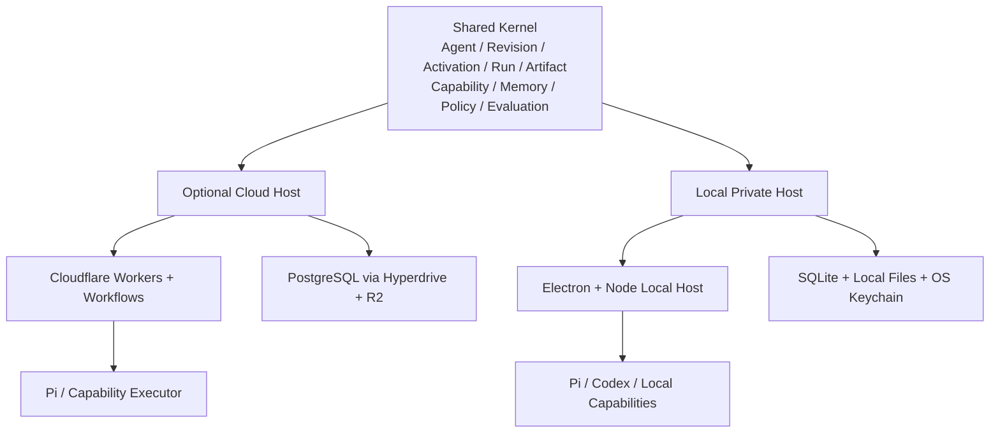

<div align="center">

# LoopEvo

### Close the loop. Evolve the work.

**An open-source general Agent platform that turns goals into reusable, self-improving Loops.**

[简体中文](./README.zh-CN.md) · [Product](./docs/design/core/product-and-architecture.md) · [Architecture](./docs/design/core/system-architecture.md) · [Roadmap](./docs/plans/roadmap.md)

</div>

> [!IMPORTANT]
> **Status: Pre-alpha / design stage.** This repository currently contains accepted product, architecture, UI, security, and roadmap documents. The app, runtime, connectors, and integrations below are planned—not implemented production features.

## What is LoopEvo?

Tell LoopEvo what you want. An Agent researches the problem, uses the capabilities available to it, completes the work, and turns repeatable or long-running work into a **Loop**.

```text
Goal
→ Agent researches and acts
→ A reusable Loop is created when repetition or recovery is needed
→ Run locally or continuously in the cloud
→ Preserve results and provenance
→ Evaluate quality, cost, and risk
→ Improve inside the user's permission boundary
```

LoopEvo is a general Agent platform. Continuous information intelligence is the first end-to-end case—not the product boundary.

## Designed for people, not workflow experts

Users should only need to understand:

| User concept | Meaning |
| --- | --- |
| **Agent** | The AI that owns a continuing goal |
| **Loop** | Work the Agent has made repeatable or continuous |
| **Activity** | What the Agent is doing or has done |
| **Result** | A useful output with sources or verification |
| **Connection** | Access to a model, data source, or delivery target |

Workflow revisions, runs, checkpoints, evaluations, and policy decisions still exist internally for reliability. They are progressive detail, not prerequisites for using the product.

## Local private or cloud

| Mode | Best for | Data path |
| --- | --- | --- |
| **Local private desktop** | Local files, browser and coding agents; privacy-sensitive work | Agents, runs, memory, and artifacts stay on the device. Model and source requests go directly from the device to providers chosen by the user. No LoopEvo cloud account or sync is required. |
| **LoopEvo Cloud** | 24/7 monitoring and scheduled work | Runs and artifacts live in the user's LoopEvo cloud account. The cloud host calls authorized providers. |

“Local private” does **not** mean offline or local-model-only. Selected prompts, file excerpts, and tool results may be sent directly to OpenAI, Anthropic, or another chosen provider. LoopEvo must disclose and constrain that scope. Local models are a future option, not an initial architecture dependency.

Local and cloud are independent by default. Portable Agent and Workflow revisions can be exported explicitly; secrets, connections, files, memory, runs, and browser state do not silently sync.

## Product principles

1. **Agent first, workflow when needed.** A one-shot task can run directly; only repeatable, scheduled, waiting, or recoverable work becomes a Workflow.
2. **Simple outside, complete inside.** Keep the user model small while preserving revisions, runs, artifacts, capabilities, memory, policy, and evaluation internally.
3. **Automatic inside the grant.** Read-only, reversible, authorized work should run without repeated approvals.
4. **Boundaries still matter.** New credentials, private scopes, higher budgets, external writes, deletion, and production code require explicit consent.
5. **Evidence before confidence.** Important results and changes point to sources, run data, or repeatable evaluations.
6. **Evolution is a versioned change.** Low-risk changes may be evaluated, activated, observed, and rolled back automatically; permissions and impact never expand silently.
7. **Vertical proof before abstraction.** Information flow proves the kernel first; a second unrelated case must validate any general SDK.

## Architecture direction

LoopEvo uses one portable kernel with two runtime hosts:



### Key boundaries

- Pi is the only native Agent loop. LoopEvo owns policy, durable runs, memory, capabilities, checkpoints, and artifacts.
- Codex and Claude are complete external Agent runtimes, delegated through small adapters rather than nested inside Pi.
- Cloudflare Workflows is the only initial cloud durable-run engine. The initial design does not add Cloudflare Agents SDK or Durable Objects as a second source of session, schedule, or recovery truth.
- PostgreSQL is the cloud business source of truth; SQLite is the local one. Runtime histories are not product audit databases.
- A portable Workflow revision becomes runnable through an `Activation` bound to `local` or `cloud`; it pins the Agent revision it uses. Importing it elsewhere creates a separate Activation.
- The first implementation starts with a small number of code boundaries, not a service or package per domain object.

Planned foundation:

| Concern | Direction |
| --- | --- |
| Shared language and UI | TypeScript, React, Vite |
| Native Agent runtime | Pi behind a LoopEvo adapter |
| Local host | Electron, Node, SQLite WAL, local artifact store, OS keychain |
| Cloud host | Cloudflare Workers, Workflows, Hyperdrive, PostgreSQL, R2 |
| Capabilities | Native adapters, MCP, Skills, controlled browser and commands |
| External Agents | Codex App Server; Claude API or native Claude Code companion |

See the [system architecture](./docs/design/core/system-architecture.md) for durable execution, policy, data, adapter, and escalation boundaries.

## First vertical: automatic information flow

A user can ask:

> Track medo.dev, competing AI website builders, and the communities discussing them. Find launches, design trends, feature requests, and complaints. Send a cited daily digest and alert me to high-value signals.

The Agent should:

1. discover competitors, terms, accounts, communities, feeds, and authoritative sites;
2. explain source value, authorization, coverage, cost, and alternatives;
3. separate backfill, events, and incremental collection;
4. prefer webhooks, streams, RSS, and reliable cursors before adaptive polling;
5. normalize, deduplicate, cluster, rank, and summarize with provenance;
6. expose source health, coverage gaps, alerts, and scheduled digests;
7. improve low-risk queries, filters, summaries, and cadence from feedback.

X is required for the Alpha, accessed through an official API, user authorization, or a contractually valid provider. RSS and targeted public web pages provide a low-cost base. Reddit, Bluesky, Facebook, and Instagram follow proven value, licensing, and cost—LoopEvo does not promise universal social coverage.

Company-specific delivery such as Ruliu remains a private adapter implementing the same delivery contract.

## Low-interruption automation

LoopEvo aims for **zero unnecessary interruption, not zero boundaries**.

Inside a scoped, revocable `PolicyGrant`, an Agent may read approved data, use selected folders, models, budgets, and delivery targets, recover from failures, and apply verified reversible improvements.

It must stop for new credentials or private data, broader permissions or budgets, a new external write target, deletion or payment, irreversible account changes, and production release of generated code.

## Local Agent integrations

- **Codex:** the planned official integration uses Codex App Server over stable stdio JSONL. Codex owns ChatGPT authentication; LoopEvo does not copy its auth file. `codex exec --json` is the fallback.
- **Claude:** the supported background path uses the commercially licensed Claude Agent SDK with an API key or supported cloud provider. Without prior Anthropic approval, LoopEvo will not expose Claude.ai login or route Free, Pro, or Max subscription usage. Companion mode is user-initiated in native Claude Code; it cannot power unattended Loops through a background CLI or proxy.
- **ACP:** retained as a future compatibility boundary once a second real external Agent requires it.

## Roadmap

1. **Local Private Foundation:** shared kernel, Electron local host, SQLite, Pi, an API-key model connection, RSS Loop, and restart recovery.
2. **Cloud Information Flow Alpha:** Cloudflare Workers / Workflows, PostgreSQL / Hyperdrive, R2, X, RSS, targeted web, and delivery.
3. **General Agent Validation:** prove the same kernel with a second non-information-flow case and validate Codex App Server before freezing extension SDKs.
4. **Verified Evolution:** evaluations, minimal changes, automatic activation inside grants, monitoring, and rollback.
5. **Controlled Coding Extension:** sandboxed candidate capabilities through Codex and other replaceable coding agents.
6. **Open Ecosystem and Teams:** only after the core contracts and governance are proven in real use.

See the [full roadmap](./docs/plans/roadmap.md) and [Foundation implementation plan](./docs/plans/foundation-implementation-plan.md).

## Deliberately deferred

- local model downloading, serving, and GPU scheduling;
- universal social-network coverage or unrestricted scraping;
- automatic cloud sync of local data and credentials;
- a complete drag-and-drop canvas, multi-agent supervisor, or public marketplace;
- enterprise organization and RBAC in the first release;
- a separate multi-user self-hosted host before its runtime and operations model is designed;
- Cloudflare Agents SDK, Durable Objects, Queues, AI Gateway, Vectorize, and Sandbox before measured need;
- Kafka, Redis, Elasticsearch, Kubernetes, or a separate vector database without evidence.

## Project status

Available now:

- accepted product, architecture, UI, reference, security, and roadmap documents;
- English and Chinese project entry points;
- Apache License 2.0 and repository knowledge-base governance.

Not implemented yet:

- web or desktop applications, API, identity, database, or deployment;
- the shared kernel, local run ledger, Pi adapter, or Cloudflare host;
- production connectors, external Agent adapters, evaluation, or evolution runtime.

## Documentation

- [Product definition and core model](./docs/design/core/product-and-architecture.md)
- [System architecture and technology baseline](./docs/design/core/system-architecture.md)
- [Reference projects and differentiation](./docs/design/core/reference-landscape.md)
- [UI design system](./docs/design/core/ui-design-system.md)
- [Product and engineering roadmap](./docs/plans/roadmap.md)
- [Foundation implementation plan](./docs/plans/foundation-implementation-plan.md)
- [Security and data governance](./docs/reference/security-and-data-governance.md)
- [Repository context](./docs/reference/repository-context.md)

## Contributing

LoopEvo is early enough for core decisions to matter. Before proposing code, read [CLAUDE.md](./CLAUDE.md), [docs/CLAUDE.md](./docs/CLAUDE.md), and the relevant design source. Do not describe planned behavior as implemented, add abstractions without a second real use, or integrate a platform without verifying authorization, terms, cost, and deletion behavior.

## Name

**Loop** is the cycle from intent to result and improvement. **Evo** is evidence-driven, bounded evolution.

## License

[Apache License 2.0](./LICENSE)
