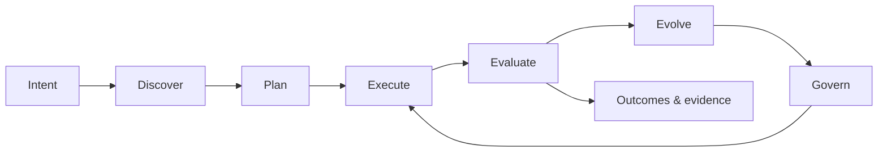
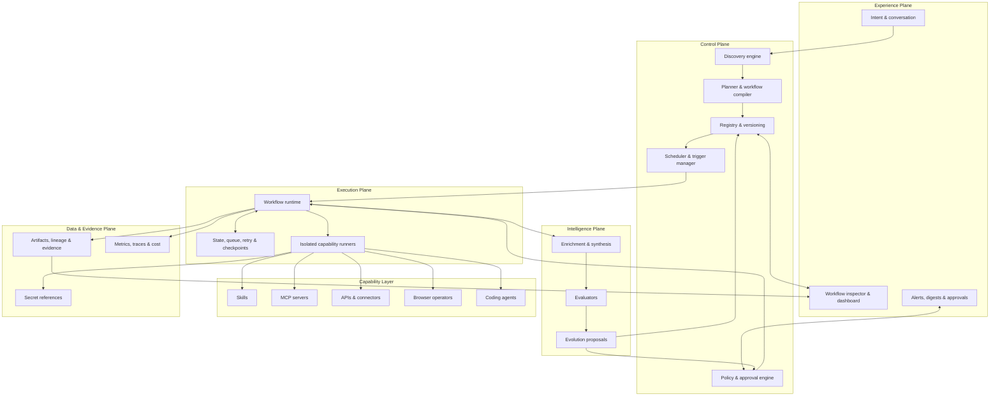
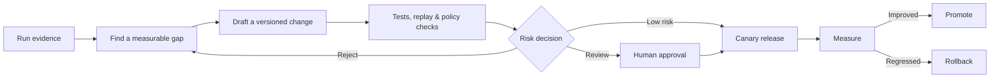

# LoopEvo

### Close the loop. Evolve the work.

**An open-source platform that turns natural-language intent into governed, reusable, and self-evolving AI workflows.**

[简体中文](./README.zh-CN.md) · [Vision](#vision) · [Architecture](#architecture) · [Roadmap](#roadmap)

> [!IMPORTANT]
> **Project status: Pre-alpha / design stage.** LoopEvo is currently a product and architecture initiative. The runtime, integrations, and user interface described below are planned—not yet available for production use.

## Vision

AI agents are increasingly good at completing a task once. Valuable work, however, rarely ends after one run. It needs to be discovered, scheduled, observed, evaluated, repaired, and improved as the world changes.

LoopEvo aims to close that gap. A user describes an outcome in natural language; LoopEvo researches the problem, proposes an inspectable workflow, executes it with durable state, measures its results, and turns evidence into governed workflow improvements.

The goal is not an agent that improvises forever. The goal is a system that converts successful reasoning and execution into **durable, versioned, explainable operations**.

## What LoopEvo Is

- **Intent-driven:** start with the result you want, not a blank automation canvas.
- **Workflow-native:** persist useful work as typed, versioned, schedulable artifacts.
- **Capability-agnostic:** compose Skills, MCP servers, APIs, browser operators, coding agents, and future adapters behind explicit contracts.
- **Evidence-aware:** retain provenance, traces, costs, evaluation results, and feedback for every run.
- **Governed by design:** use policies, tests, approvals, canaries, and rollback before adopting changes.
- **Built to evolve:** improve sources, prompts, tools, routing, and workflow structure from measured outcomes.

LoopEvo is not a promise of unrestricted access to third-party data, an uncontrolled self-modifying production agent, or a replacement for every chat assistant and automation tool.

## Why It Matters

Today, users often have to choose between three incomplete experiences:

| Category | Strength | Common gap |
| --- | --- | --- |
| Chat-first agents | Flexible reasoning in the current session | Useful processes often disappear with the conversation |
| Workflow automation | Reliable repeat execution | Users must manually discover sources and assemble the graph |
| Agent frameworks | Powerful building blocks for developers | Product-level state, governance, evaluation, and operations remain custom work |

LoopEvo focuses on the layer between them: **intent-to-workflow discovery plus a durable, evaluable, governed runtime**. It is designed to collaborate with general-purpose agents and existing automation systems, not merely duplicate them.

## Product Principles

1. **Intent first, graph second.** Users state outcomes; the system explains the workflow it derives.
2. **Durable by default.** Useful work should be replayable, schedulable, observable, and versioned.
3. **Evidence over confidence.** Conclusions and changes should be traceable to sources, runs, and evaluations.
4. **Evolution is governed.** Improvement is proposed and verified before it is adopted.
5. **Capabilities are modular.** Every tool has declared inputs, outputs, permissions, cost, and failure behavior.
6. **Cost is a design constraint.** Freshness, coverage, quality, latency, and spend are optimized together.
7. **Humans stay in control.** High-impact actions cross explicit review and approval boundaries.
8. **Real vertical slices shape the platform.** Topic intelligence is the first case, not a one-off architecture.

## Core Lifecycle

### 1. Intent

Capture the desired outcome, scope, cadence, constraints, budget, and success criteria through conversation.

### 2. Discover

Research the domain and identify entities, sources, capabilities, access methods, and risks. The proposed source and tool plan stays visible to the user.

### 3. Plan

Compile the accepted proposal into a durable workflow: triggers, typed steps, policies, checkpoints, evaluation criteria, and capability dependencies.

### 4. Execute

Run on demand, on a schedule, or from an event. Preserve state, retries, deduplication, artifacts, and evidence across runs.

### 5. Evaluate

Measure usefulness, accuracy, freshness, coverage, reliability, latency, and cost. Combine automated evaluators with explicit user feedback.

### 6. Evolve

Propose targeted changes based on evidence. Test them against policies, fixtures, and historical runs before approval, canary release, or rollback.

## Architecture

LoopEvo separates conversation and planning from execution, evidence, and change control.

### Conceptual Components

| Component | Responsibility |
| --- | --- |
| Intent & discovery | Turn a goal into a researched proposal of sources, capabilities, constraints, and success criteria |
| Planner & compiler | Produce a typed workflow graph with triggers, policies, dependencies, and evaluation hooks |
| Registry & versioning | Store workflow definitions, capability contracts, provenance, releases, and rollback targets |
| Scheduler & triggers | Start recurring, event-driven, and manual runs with explicit cadence and budget policies |
| Workflow runtime | Execute steps, preserve state, isolate failures, retry safely, and emit evidence |
| Capability layer | Adapt Skills, MCP, APIs, browsers, and generated modules through common contracts |
| Evidence & observability | Retain artifacts, lineage, metrics, traces, cost, and access records |
| Evaluation & evolution | Score outcomes and draft testable, versioned improvement proposals |
| Governance | Enforce permissions, privacy, budgets, approvals, release controls, and rollback |

Technology choices for the runtime, data stores, queues, and deployment topology are intentionally open until implementation research validates them.

## The Durable Workflow Artifact

A LoopEvo workflow is intended to be a versioned artifact—not an opaque transcript. Its conceptual contract includes:

- intent, scope, and measurable success criteria;
- manual, scheduled, or event-driven triggers;
- a typed execution graph and capability dependencies;
- source-selection rationale and access constraints;
- state, checkpoints, deduplication, retry, and idempotency semantics;
- budget, privacy, safety, and approval policies;
- an evaluation suite and acceptance thresholds;
- provenance, version history, release state, and rollback target.

The concrete schema will be proposed and versioned during the foundation phase.

## Capabilities and Extensibility

LoopEvo plans to treat capabilities as interchangeable modules with explicit manifests. A capability should declare what it can do, the data and permissions it needs, expected cost and latency, its failure modes, and how it can be tested.

Planned capability types include:

- **Skills** for packaged domain knowledge and repeatable procedures;
- **MCP servers** for standardized tool and context access;
- **APIs and connectors** for authorized structured integrations;
- **browser operators** for permitted web interactions where APIs are insufficient;
- **coding agents** for proposing or implementing missing modules.

A coding agent is not a bypass around engineering controls. Generated modules should be reviewed, tested, versioned, sandboxed, observed, and released through the same policies as human-written code.

## Governed Evolution

“Self-evolving” does not mean silently rewriting production workflows.

Evolution may target source coverage, cadence, filters, prompts, models, routing, workflow structure, or capability code. Every adopted change should have evidence, an accountable version, and a recovery path.

## Flagship Use Case: Topic Intelligence

Topic intelligence is the first planned end-to-end case for validating the platform.

A user might ask:

> Monitor AI website builders, including MeDo and relevant competitors. Track product updates, feature requests, complaints, community discussions, and emerging design trends. Alert me when something matters and summarize what we should learn each day.

LoopEvo should then:

1. research the space and propose entities, competitors, keywords, communities, and sources;
2. explain why each source matters and how it can be accessed;
3. persist the approved collection and analysis workflow;
4. collect incrementally with checkpoints and deduplication;
5. enrich, cluster, rank, and summarize evidence;
6. deliver timely alerts, scheduled digests, and a searchable full-fidelity view;
7. learn from misses and feedback to improve coverage, cadence, filters, and synthesis.

Potential sources include X, Reddit, Facebook, Instagram, Bluesky, RSS feeds, public websites, and licensed data providers. Actual coverage depends on official API availability, account authorization, contracts, platform terms, privacy requirements, and regional law. LoopEvo connectors should expose those constraints instead of pretending they do not exist.

The same loop can later support research watchlists, learning plans, market intelligence, technical change tracking, and repeatable data-analysis workflows.

## How LoopEvo Is Different

LoopEvo is designed around the lifecycle **after a useful agent run**:

- turn the successful path into a durable workflow;
- preserve source and decision provenance;
- run it repeatedly with state and budgets;
- measure whether the outcome remains useful;
- improve it through controlled, reversible versions.

General-purpose agents can remain the reasoning and execution engines inside LoopEvo. Existing automation tools can remain downstream executors. LoopEvo's focus is the product and control layer that discovers, governs, evaluates, and evolves the complete workflow.

## Roadmap

The roadmap is outcome-oriented and will evolve through public design work.

| Phase | Outcome | Status |
| --- | --- | --- |
| 0. Foundation | Product contract, architecture decisions, workflow schema, security model, and contribution process | **In progress** |
| 1. Topic intelligence slice | Natural-language brief → source plan → incremental collection → evidence-backed digest | Planned |
| 2. Intent-to-workflow | Reusable planner, capability registry, workflow compiler, scheduler, and run inspector | Planned |
| 3. Evaluation & evolution | Evaluation suites, feedback loops, version proposals, approval, canary, and rollback | Planned |
| 4. Ecosystem | Connector SDK, reusable workflow packs, deployment profiles, and community registry | Planned |

Near-term work will prioritize a narrow, reliable vertical slice over broad but shallow integrations.

## Project Status

LoopEvo is currently at **pre-alpha / design stage**. This repository establishes the product contract and architecture direction so implementation can proceed against clear boundaries.

There is no runnable release yet. Watch the repository for architecture decisions, milestones, and the first vertical-slice implementation.

## Contributing

LoopEvo is being designed in the open. Early contributions are especially useful around:

- workflow and capability contracts;
- evaluation and safe-evolution methods;
- source connectors and incremental collection strategies;
- security, sandboxing, privacy, and governance;
- topic-intelligence datasets and end-to-end scenarios;
- product feedback from real recurring workflows.

Open an issue to share a use case or design proposal. As the implementation foundation lands, repository-specific development and review guidelines will be added before accepting production code changes.

## Name

**LoopEvo** combines **Loop** and **Evolution**: close the execution-feedback loop, then evolve the workflow from evidence.

## License

Licensed under the [Apache License 2.0](./LICENSE).

---

**LoopEvo — turn intent into a system that keeps learning how to work better.**

