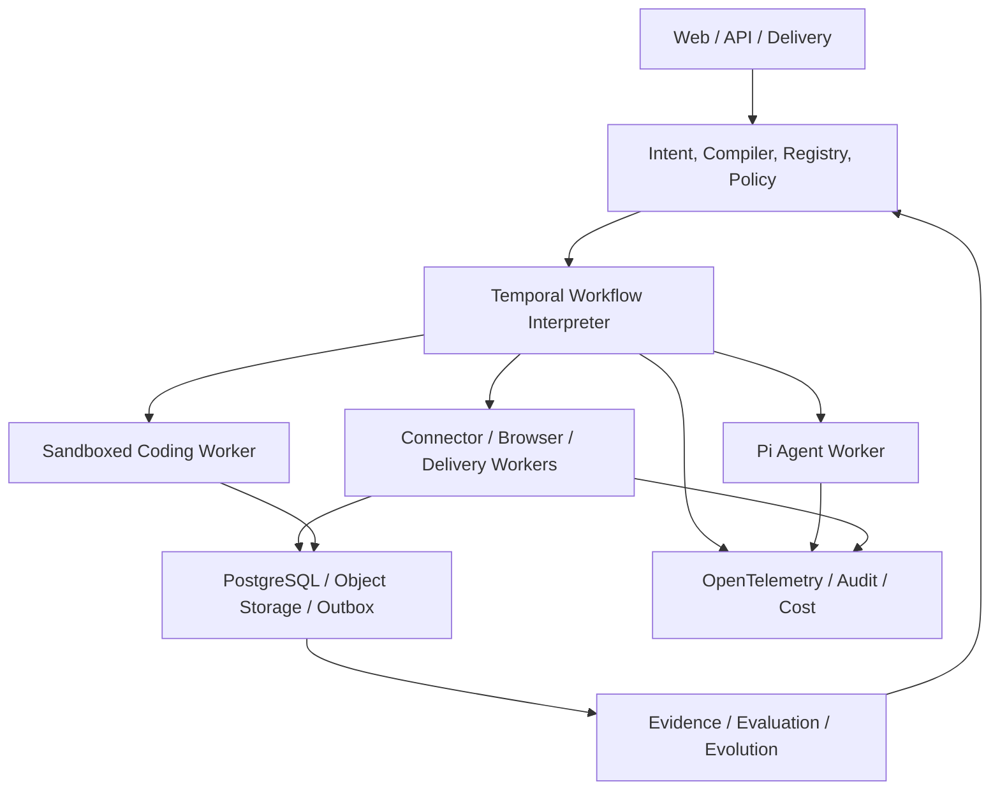

<div align="center">

# LoopEvo

### Close the loop. Evolve the work.

**An open-source goal-to-workflow platform for durable, evidence-driven, and governed AI workflows.**

[简体中文](./README.zh-CN.md) · [Product](./docs/design/core/product-and-architecture.md) · [Architecture](./docs/design/core/system-architecture.md) · [Roadmap](./docs/plans/roadmap.md)

</div>

> [!IMPORTANT]
> **Status: Pre-alpha / design stage.** LoopEvo currently contains product, architecture, UI, roadmap, and repository-governance documents. The application, runtime, connectors, and integrations described below are accepted designs or plans—not implemented production features.

## What is LoopEvo?

LoopEvo turns a continuing goal expressed in natural language into an inspectable, durable workflow that can run, preserve evidence, measure outcomes, and evolve under explicit controls.

```text
Goal
→ Research sources and capabilities
→ Propose an inspectable workflow
→ Approve and release a version
→ Execute with durable state
→ Preserve evidence and outcomes
→ Evaluate quality, cost, and risk
→ Propose a minimal change
→ Replay, review, canary, promote, or roll back
```

The product asset is not a chat transcript or an endlessly improvising agent. It is a set of versioned `WorkflowVersion`, `Run`, `Evidence`, `Evaluation`, and `EvolutionProposal` objects.

## Why?

Existing tools usually solve only part of the loop:

| Category | Strength | Common gap |
| --- | --- | --- |
| Chat agents | Flexible reasoning now | Valuable methods disappear with the session |
| Automation platforms | Reliable repetition and increasingly AI-assisted workflow creation | Source strategy, provenance, version-pinned runs, and governed evolution remain product-specific |
| Agent frameworks | Strong developer primitives | Product state, evidence, policy, evaluation, and operations remain custom |
| Vertical intelligence tools | Ready-made domain data | Sources and methods rarely transfer to another goal |

LoopEvo focuses on the missing layer: **discover the workflow from the goal, then keep that workflow observable, reproducible, evaluable, and safely improvable.**

## Who is it for?

The Phase 1 beachhead is the product or growth lead responsible for competitive and customer intelligence in a small software or AI product team. They can judge signal quality and obtain provider access, but do not want to begin with APIs, cron jobs, scrapers, agent frameworks, or a blank canvas.

Technical founders or engineering leads make deployment, provider, and security decisions. Expansion audiences are:

- researchers and operations teams applying the same loop to research or recurring operations;
- administrators governing shared workflows, credentials, budgets, and approvals;
- developers building Connectors, Skills, MCP adapters, evaluators, and delivery channels;
- platform teams self-hosting the core and integrating identity, secrets, audit, and notifications.

## Product experience

LoopEvo uses **chat as the control plane and durable views as the fact plane**:

- **Conversation:** state the goal, review research, grant access, and request changes;
- **Workflow:** inspect triggers, steps, sources, capabilities, policies, budgets, and the active release;
- **Runs:** follow progress, waits, retries, failures, costs, and recovery;
- **Evidence:** trace a conclusion back to raw content, source, time, hash, and derivation;
- **Evaluations:** compare quality, coverage, freshness, noise, reliability, and cost;
- **Approvals:** review permissions, external side effects, workflow diffs, canaries, and rollback points.

A visual graph explains the generated workflow; it is not the default starting point.

## Product principles

1. **Intent first, graph second.** Start from an outcome and explain the derived workflow.
2. **Workflow is the product.** Persist useful work as typed, immutable, schedulable versions.
3. **Evidence before confidence.** Every important conclusion and change points to sources and runs.
4. **Deterministic by default.** Code owns auth, collection, checkpoints, deduplication, retries, budgets, approvals, and delivery; agents own judgment.
5. **Governed evolution.** Agents propose versions; they never silently rewrite production workflows or code.
6. **Least capability.** Every run receives only its declared data, tools, credentials, and network scope.
7. **Cost is observable.** Freshness, coverage, quality, latency, and spend are optimized together.
8. **Real vertical slices shape the platform.** Topic intelligence comes before broad framework abstractions.

## Architecture direction

Pi is the provisional planned agent runtime. Temporal is the provisional planned durable workflow engine. PostgreSQL is the planned product source of truth. Phase 0 spikes must validate these choices before dependencies become implementation facts.



### Key boundaries

- A Pi Agent Step is one reasoning Activity that returns `tool_request` or `final`; each external tool runs as a separate Capability Activity.
- Temporal owns recovery history; PostgreSQL owns queryable product state, versions, collection checkpoints, evidence, evaluations, and approvals.
- External I/O runs in isolated Activity Workers behind versioned capability contracts; Temporal Workflow code remains deterministic.
- Workflow, capability, prompt, model, connector, and policy versions are pinned for every run.
- Event, webhook, or reliable incremental checkpoint collection is preferred over fixed polling.
- Coding agents create reviewed candidates in a sandbox; running workflows never hot-load generated code.
- The MVP does not run two Agent runtimes or two workflow engines at once, and does not add Kafka, Kubernetes, a multi-agent supervisor, or a full drag-and-drop canvas.

Planned core technologies:

| Concern | Direction |
| --- | --- |
| Language and UI | TypeScript, React / Next.js, Tailwind CSS, Radix primitives |
| Agent runtime | `@earendil-works/pi-ai` and `@earendil-works/pi-agent-core` behind LoopEvo adapters |
| Durable execution | Temporal TypeScript SDK |
| Product data | PostgreSQL, Postgres Outbox, S3-compatible object storage |
| Capabilities | Native connectors, Playwright, MCP TypeScript SDK, Skills, webhooks |
| Observability | OpenTelemetry with a replaceable analysis backend |

See the [system architecture](./docs/design/core/system-architecture.md) for contracts, data flow, Pi package decisions, security, testing, and deployment boundaries.

## Flagship use case: topic intelligence

A user may ask:

> Track medo.dev, competing AI website builders, and relevant community discussion. Surface launches, design trends, feature requests, and complaints. Send a cited daily digest and alert me when a high-value signal appears.

The planned workflow will:

1. discover brands, competitors, category terms, communities, accounts, and authoritative sites;
2. explain the value, access method, coverage, cost, and authorization limits of each source;
3. separate historical backfill from incremental collection;
4. use events, checkpoints, watermarks, fingerprints, and idempotency to avoid waste and duplication;
5. normalize, cluster, rank, analyze, and summarize content with citations;
6. provide alerts, digests, searchable evidence, run traces, and coverage gaps;
7. propose source, cadence, filter, and analysis improvements from feedback and measured outcomes.

X is a required Alpha source, integrated through an official API, user authorization, or a contractually valid provider. RSS and targeted public web pages provide the low-cost base. Reddit and other networks follow real value, licensing, and cost—not a promise of universal coverage.

Company-specific delivery, such as a Ruliu adapter, stays outside the open-source core and implements the same delivery contract.

## How LoopEvo is different

| Reference | Primary asset | What LoopEvo adds |
| --- | --- | --- |
| OpenClaw / Hermes | A persistent, learning agent | Versioned workflows, source strategy, evidence, evaluation, and controlled promotion |
| Codex / Claude Code | A verifiable software task or reusable coding workflow | Long-lived domain workflows, provider cursors, durable runs, quality and cost gates |
| n8n / Dify | AI-assisted automation or AI applications | Versioned source strategy, raw evidence, fixed-version runs, and a governed release chain |
| Gumloop | Conversational automation with evaluations and reflections | Portable self-hosted contracts, immutable releases, provenance, replay, canary, and rollback |

In one line: **LoopEvo makes the workflow—not the agent—the durable unit of learning.**

## Roadmap

The roadmap advances through evidence-based gates rather than date promises:

1. **Foundation:** a local goal → version → durable run → evidence walking skeleton;
2. **Topic Intelligence Alpha:** RSS, targeted web, one authorized X provider, incremental collection, cited digests, and webhook delivery;
3. **Reusable Workflow Core:** stable schemas, connector SDK, triggers, policy, dry run, replay, and self-host operations;
4. **Governed Evolution:** datasets, diffs, offline evaluation, approval, canary, promotion, and rollback;
5. **Sandboxed Coding Extension:** reviewed Connector and Skill candidates from replaceable coding agents;
6. **Open Ecosystem & Teams:** trusted distribution, team governance, and portable managed/self-hosted operation.

See the [full roadmap](./docs/plans/roadmap.md) for scope, exit criteria, metrics, and deferred work.

## What is deliberately deferred

- unrestricted scraping or universal social-network coverage;
- a general desktop/voice assistant and dozens of chat channels;
- a complete visual workflow editor, agent teams, and a public marketplace;
- unreviewed self-modification of workflows, skills, connectors, or production code;
- Kafka, Redis, Elasticsearch, Kubernetes, or a separate vector database without measured need.

## Project status

Available now:

- accepted product, architecture, UI, reference, security, and roadmap documents;
- English and Chinese project entry points;
- Apache License 2.0 and repository knowledge-base governance.

Not implemented yet:

- application, API, CLI, identity, database schema, or deployment;
- WorkflowSpec compiler, Temporal workflows, Pi adapter, or workers;
- production connectors, evidence pipeline, evaluation, notifications, or evolution runtime.

## Documentation

- [Product definition and core model](./docs/design/core/product-and-architecture.md)
- [System architecture and technology baseline](./docs/design/core/system-architecture.md)
- [Reference projects and differentiation](./docs/design/core/reference-landscape.md)
- [UI design system](./docs/design/core/ui-design-system.md)
- [Product and engineering roadmap](./docs/plans/roadmap.md)
- [Security and data governance](./docs/reference/security-and-data-governance.md)
- [Repository context](./docs/reference/repository-context.md)

## Contributing

LoopEvo is early enough for core decisions to matter. Contributions are welcome in product critique, architecture, workflow semantics, connectors, evaluation, security, and developer experience.

Before proposing code, read [CLAUDE.md](./CLAUDE.md), [docs/CLAUDE.md](./docs/CLAUDE.md), and the relevant design source. Do not describe planned behavior as implemented, and do not add a platform integration without verifying its authorization, terms, cost, and deletion model.

## Name

**Loop** represents the continuous cycle from intent to evidence and improvement. **Evo** represents governed evolution based on measured outcomes.

## License

[Apache License 2.0](./LICENSE)
