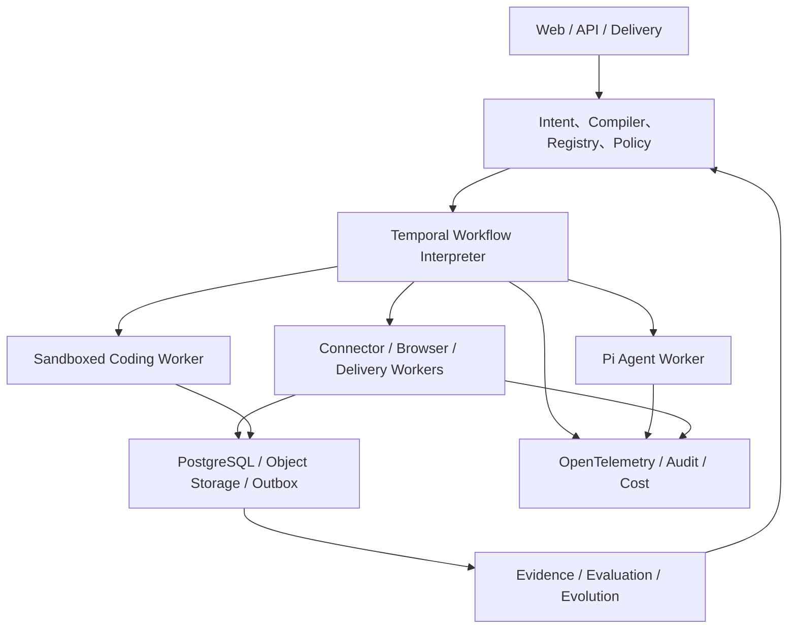

<div align="center">

# LoopEvo

### 闭合工作循环，让流程持续进化。

**一个将目标转化为持久、有证据、受治理 AI 工作流的开源平台。**

[English](./README.md) · [产品](./docs/design/core/product-and-architecture.md) · [架构](./docs/design/core/system-architecture.md) · [路线图](./docs/plans/roadmap.md)

</div>

> [!IMPORTANT]
> **状态：Pre-alpha / 设计阶段。** LoopEvo 当前包含产品、架构、UI、路线图和仓库治理文档。下文描述的应用、运行时、连接器和集成均为已采纳设计或规划能力，并非已经实现的生产功能。

## LoopEvo 是什么？

LoopEvo 将自然语言表达的持续目标转化为可审查、可长期运行的工作流。工作流能够执行、保存证据、衡量结果，并在明确治理下持续改进。

```text
目标
→ 调研信源与能力
→ 提出可审查工作流
→ 审批并发布版本
→ 持久执行
→ 保留证据与结果
→ 评估质量、成本与风险
→ 提出最小变更
→ 回放、评审、灰度、晋升或回滚
```

产品资产不是聊天记录，也不是永远即兴发挥的 Agent，而是一组版本化的 `WorkflowVersion`、`Run`、`Evidence`、`Evaluation` 和 `EvolutionProposal` 对象。

## 为什么需要它？

现有工具通常只解决闭环的一部分：

| 类别 | 擅长 | 常见缺口 |
| --- | --- | --- |
| 对话 Agent | 当前会话中的灵活推理 | 有效方法随会话消失 |
| 自动化平台 | 可靠重复执行，并逐步支持 AI 辅助生成流程 | 信源策略、证据来源、固定版本 Run 和治理进化仍是各产品自定义能力 |
| Agent 框架 | 强大的开发者基础能力 | 产品状态、证据、策略、评估和运营仍需自建 |
| 垂直情报工具 | 开箱即用的领域数据 | 来源和方法很难迁移到其他目标 |

LoopEvo 聚焦缺失的一层：**从目标发现工作流，再让工作流可观测、可复现、可评估并可安全改进。**

## 目标用户

Phase 1 的首要用户是小型软件 / AI 产品团队中负责竞争与用户情报的产品或增长负责人。他们能判断信号质量并获得 Provider 授权，但不希望从 API、Cron、抓取器、Agent 框架或空白画布开始。

技术创始人或工程负责人负责部署、Provider 与安全决策。扩展用户包括：

- 将同一闭环用于研究或重复运营任务的研究人员和运营团队；
- 管理共享工作流、凭据、预算和审批的管理员；
- 开发 Connector、Skill、MCP Adapter、评估器和交付渠道的开发者；
- 自托管核心并接入身份、秘密、审计和通知的平台团队。

## 产品体验

LoopEvo 使用 **对话作为控制面，持久视图作为事实面**：

- **Conversation：** 表达目标、审查调研、授权能力和提出变更；
- **Workflow：** 查看触发器、步骤、信源、能力、策略、预算和当前 Release；
- **Runs：** 跟踪进度、等待、重试、失败、成本和恢复；
- **Evidence：** 从结论回到原始内容、来源、时间、哈希和派生关系；
- **Evaluations：** 对比质量、覆盖、时效、噪声、可靠性和成本；
- **Approvals：** 审查权限、外部副作用、工作流 Diff、灰度和回滚点。

流程图用于解释生成的工作流，不是默认起点。

## 产品原则

1. **Intent first, graph second：** 从结果开始，并解释推导出的工作流。
2. **Workflow is the product：** 将有效方法沉淀为有类型、不可变、可调度的版本。
3. **Evidence before confidence：** 每个重要结论和变更都指向来源与运行证据。
4. **Deterministic by default：** 普通代码负责授权、采集、检查点、去重、重试、预算、审批和交付；Agent 负责判断。
5. **Governed evolution：** Agent 提出版本，绝不静默改写生产工作流或代码。
6. **Least capability：** 每次运行只获得声明的数据、工具、凭据和网络范围。
7. **Cost is observable：** 新鲜度、覆盖、质量、延迟和费用共同优化。
8. **Real vertical slices shape the platform：** 先完成主题情报闭环，再扩展框架抽象。

## 架构方向

Pi 是暂定的计划 Agent 运行时，Temporal 是暂定的计划持久工作流引擎，PostgreSQL 是计划中的产品事实源。Phase 0 Spike 必须先验证这些选择，依赖落地后才能成为实现事实。



### 关键边界

- 一次 Pi Agent Step 是返回 `tool_request` 或 `final` 的推理 Activity；每个外部 Tool 由独立 Capability Activity 执行；
- Temporal 保存恢复历史；PostgreSQL 保存可查询的产品状态、版本、采集检查点、证据、评估和审批；
- 外部 I/O 在隔离的 Activity Worker 中通过版本化能力契约执行；Temporal Workflow 代码保持确定性；
- 每次运行固定 Workflow、Capability、Prompt、Model、Connector 和 Policy 版本；
- 优先使用事件、Webhook 或可靠增量 checkpoint，不默认固定轮询；
- Coding Agent 在沙箱中生成待评审候选，运行中的工作流绝不热加载生成代码；
- MVP 不并存两套 Agent Runtime 或两套 Workflow Engine，也不引入 Kafka、Kubernetes、多 Agent Supervisor 或完整拖拽画布。

计划中的核心技术：

| 关注点 | 方向 |
| --- | --- |
| 语言与 UI | TypeScript、React / Next.js、Tailwind CSS、Radix primitives |
| Agent 运行时 | 由 LoopEvo Adapter 封装的 `@earendil-works/pi-ai` 和 `@earendil-works/pi-agent-core` |
| 持久执行 | Temporal TypeScript SDK |
| 产品数据 | PostgreSQL、Postgres Outbox、S3 兼容对象存储 |
| 能力 | Native Connector、Playwright、MCP TypeScript SDK、Skills、Webhooks |
| 可观测 | OpenTelemetry 与可替换分析后端 |

契约、数据流、Pi 包选择、安全、测试和部署边界见[系统架构](./docs/design/core/system-architecture.md)。

## 旗舰用例：主题情报

用户可以提出：

> 持续跟踪 medo.dev、同类 AI 建站产品及其用户讨论；发现产品发布、设计趋势、功能诉求和抱怨；每天生成有引用的简报，高价值信号即时通知。

规划中的工作流将：

1. 发现品牌、竞品、品类词、社区、账号和权威站点；
2. 解释每个来源的价值、访问方式、覆盖、费用和授权限制；
3. 区分历史回填与增量采集；
4. 使用事件、checkpoint、watermark、内容指纹和幂等键避免浪费与重复；
5. 规范化、聚类、排序、分析并生成带引用的总结；
6. 提供告警、简报、可搜索证据、Run Trace 和覆盖缺口；
7. 根据反馈和真实结果提出信源、周期、过滤器与分析方式的改进。

X 是 Alpha 必须支持的来源，接入必须通过官方 API、用户授权或合同有效的 Provider。RSS 和定向公开网页提供低成本基础覆盖；Reddit 和其他网络按真实价值、许可与成本加入，而不是承诺全平台覆盖。

如流等公司专用交付方式位于开源核心之外，并实现同一个 Delivery Contract。

## LoopEvo 的差异

| 参照 | 主要资产 | LoopEvo 增加的能力 |
| --- | --- | --- |
| OpenClaw / Hermes | 持续存在、持续学习的 Agent | 版本化工作流、信源策略、证据、评估和受控晋升 |
| Codex / Claude Code | 可验证的软件任务或可重用编码工作流 | 长期领域工作流、Provider 游标、持久 Run、质量与成本门槛 |
| n8n / Dify | AI 辅助的自动化或 AI 应用 | 版本化信源策略、原始证据、固定版本 Run 和治理发布链 |
| Gumloop | 带评估与反思的对话式自动化 | 可移植自托管契约、不可变 Release、来源追溯、Replay、Canary 和 Rollback |

一句话：**LoopEvo 让工作流，而不是 Agent，成为持续学习的长期单元。**

## 路线图

路线图按证据门槛推进，不做日期承诺：

1. **Foundation：** 本地目标 → 版本 → 持久 Run → Evidence 最小骨架；
2. **Topic Intelligence Alpha：** RSS、定向 Web、一个授权 X Provider、增量采集、引用简报和 Webhook 交付；
3. **Reusable Workflow Core：** 稳定 Schema、Connector SDK、触发、策略、Dry Run、Replay 和自托管运维；
4. **Governed Evolution：** 数据集、Diff、离线评估、审批、灰度、晋升和回滚；
5. **Sandboxed Coding Extension：** 可替换 Coding Agent 生成经过评审的 Connector 和 Skill 候选；
6. **Open Ecosystem & Teams：** 可信分发、团队治理以及 Managed / Self-host 之间的可移植性。

完整范围、退出条件、指标和延后项见[路线图](./docs/plans/roadmap.md)。

## 明确延后

- 不受限制的抓取或所有社交网络覆盖；
- 通用桌面 / 语音助理和几十个聊天渠道；
- 完整可视编排器、Agent Teams 和公共市场；
- 未经评审的 Workflow、Skill、Connector 或生产代码自修改；
- 没有真实测量需求的 Kafka、Redis、Elasticsearch、Kubernetes 或独立向量数据库。

## 项目状态

当前已有：

- 已采纳的产品、架构、UI、参考项目、安全和路线图文档；
- 中英文项目入口；
- Apache License 2.0 与仓库知识库治理。

当前尚未实现：

- 应用、API、CLI、身份、数据库 Schema 或部署；
- WorkflowSpec Compiler、Temporal Workflow、Pi Adapter 或 Worker；
- 生产 Connector、Evidence Pipeline、Evaluation、通知或进化运行时。

## 文档

- [产品定义与核心模型](./docs/design/core/product-and-architecture.md)
- [系统架构与技术基线](./docs/design/core/system-architecture.md)
- [参考项目与差异化](./docs/design/core/reference-landscape.md)
- [UI 设计体系](./docs/design/core/ui-design-system.md)
- [产品与工程路线图](./docs/plans/roadmap.md)
- [安全与数据治理](./docs/reference/security-and-data-governance.md)
- [仓库上下文](./docs/reference/repository-context.md)

## 参与贡献

LoopEvo 仍处于核心决策会显著影响产品的早期阶段。欢迎围绕产品批评、架构、工作流语义、连接器、评估、安全和开发者体验贡献。

提交代码前请阅读 [CLAUDE.md](./CLAUDE.md)、[docs/CLAUDE.md](./docs/CLAUDE.md) 和相关设计事实源。不得把规划能力描述为已经实现；新增平台集成前必须验证授权、条款、成本和删除模型。

## 名称含义

**Loop** 表示从意图到证据再到改进的持续闭环；**Evo** 表示基于真实结果、受治理的进化。

## 许可证

[Apache License 2.0](./LICENSE)
