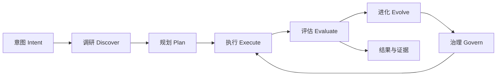
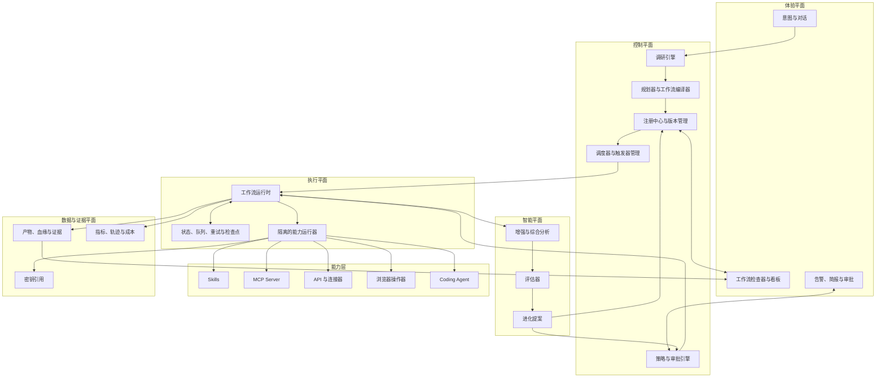
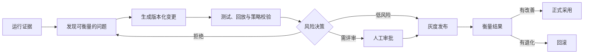

# LoopEvo

### 闭合工作循环，让流程持续进化。

**一个将自然语言意图转化为可治理、可复用、自进化 AI 工作流的开源平台。**

[English](./README.md) · [产品愿景](#产品愿景) · [系统架构](#系统架构) · [路线图](#路线图)

> [!IMPORTANT]
> **项目状态：Pre-alpha / 设计阶段。** LoopEvo 当前仍处于产品与架构设计阶段。下文描述的运行时、集成能力和用户界面均为规划能力，尚不能用于生产环境。

## 产品愿景

AI Agent 已经越来越擅长一次性完成任务，但真正有价值的工作很少在一次执行后结束。它需要被发现、定时运行、持续观测、评估、修复，并随着外部世界的变化不断改进。

LoopEvo 希望补上这一层：用户用自然语言描述目标，LoopEvo 调研问题、提出可检查的工作流、以持久状态执行、衡量结果，再将运行证据转化为受治理的工作流改进。

目标并不是让 Agent 永无止境地临场发挥，而是把有效的推理与执行固化成**持久、可版本化、可解释的生产流程**。

## LoopEvo 是什么

- **意图驱动：** 从用户想得到的结果开始，而不是让用户面对空白的自动化画布。
- **工作流原生：** 将有效流程沉淀成类型明确、可版本化、可调度的持久资产。
- **能力无关：** 通过显式契约组合 Skills、MCP Server、API、浏览器操作器、Coding Agent 及未来适配器。
- **证据感知：** 为每次运行保留来源、轨迹、成本、评估结果和用户反馈。
- **治理优先：** 在采纳变更前执行策略校验、测试、审批、灰度和回滚。
- **面向进化：** 根据真实结果持续改进信息源、提示词、工具、路由和工作流结构。

LoopEvo 不承诺不受限制地访问第三方数据，不构建失控的生产环境自修改 Agent，也不试图替代所有聊天助手和自动化工具。

## 为什么需要 LoopEvo

今天的用户通常需要在三种不完整的体验之间做选择：

| 类型 | 优势 | 常见缺口 |
| --- | --- | --- |
| 对话优先的 Agent | 能在当前会话中灵活推理 | 有效流程往往随着会话结束而消失 |
| 工作流自动化平台 | 可以稳定地重复执行 | 用户必须自己发现信息源并手工编排流程图 |
| Agent 开发框架 | 为开发者提供强大的基础模块 | 产品级状态、治理、评估和运行保障仍需自行建设 |

LoopEvo 聚焦它们之间缺失的一层：**从意图发现工作流，加上持久、可评估、受治理的运行时**。它的设计目标是与通用 Agent 和现有自动化系统协作，而不是简单复制它们。

## 产品原则

1. **先有意图，再有流程图。** 用户描述结果，系统解释自己推导出的工作流。
2. **默认持久化。** 有效工作应当可重放、可调度、可观测、可版本化。
3. **证据比自信重要。** 结论与变更都应能追溯到来源、运行记录和评估结果。
4. **进化必须受治理。** 改进需要先提出并验证，之后才能被采用。
5. **能力必须模块化。** 每项工具都应声明输入、输出、权限、成本和失败行为。
6. **成本是设计约束。** 新鲜度、覆盖率、质量、延迟和费用需要联合优化。
7. **人始终保有控制权。** 高影响操作必须经过明确的检查与审批边界。
8. **用真实垂直场景塑造平台。** 主题情报是第一个端到端用例，而不是一次性特例。

## 核心生命周期

### 1. 意图

通过对话获取期望结果、范围、周期、约束、预算和成功标准。

### 2. 调研

研究领域并识别实体、信息源、可用能力、访问方式与风险；拟议的信息源和工具计划始终对用户可见。

### 3. 规划

将用户认可的方案编译成持久工作流：触发器、类型明确的步骤、策略、检查点、评估标准和能力依赖。

### 4. 执行

按需、按计划或由事件触发执行，并跨运行保存状态、重试、去重、产物和证据。

### 5. 评估

衡量有用性、准确性、新鲜度、覆盖率、可靠性、延迟和成本，将自动化评估与用户明确反馈结合起来。

### 6. 进化

根据证据提出有针对性的变更，在审批、灰度发布或回滚前，通过策略、测试样例和历史运行进行验证。

## 系统架构

LoopEvo 将对话和规划，与执行、证据及变更控制相分离。

### 概念组件

| 组件 | 职责 |
| --- | --- |
| 意图与调研 | 将目标转化为经过调研的信息源、能力、约束和成功标准提案 |
| 规划器与编译器 | 生成包含触发器、策略、依赖和评估钩子的类型化工作流图 |
| 注册中心与版本管理 | 存储工作流定义、能力契约、来源、发布版本和回滚目标 |
| 调度器与触发器 | 根据明确的周期与预算策略启动定时、事件驱动和手动任务 |
| 工作流运行时 | 执行步骤、保存状态、隔离故障、安全重试并生成证据 |
| 能力层 | 通过统一契约适配 Skills、MCP、API、浏览器和生成模块 |
| 证据与可观测性 | 保存产物、血缘、指标、轨迹、成本和访问记录 |
| 评估与进化 | 评价结果并生成可测试、可版本化的改进提案 |
| 治理 | 执行权限、隐私、预算、审批、发布控制和回滚策略 |

运行时语言、数据存储、队列和部署拓扑等技术选型会保持开放，直到实现阶段的调研能够验证它们。

## 持久工作流资产

LoopEvo 工作流应当是可版本化的资产，而不是不透明的聊天记录。其概念契约包括：

- 意图、范围和可衡量的成功标准；
- 手动、定时或事件驱动触发器；
- 类型明确的执行图和能力依赖；
- 信息源选择理由与访问约束；
- 状态、检查点、去重、重试和幂等语义；
- 预算、隐私、安全和审批策略；
- 评估套件与验收阈值；
- 来源、版本历史、发布状态和回滚目标。

具体 Schema 将在基础阶段提出，并通过版本化机制持续演进。

## 能力与扩展机制

LoopEvo 计划将能力视为带有显式清单、可互换的模块。每项能力都应声明它能做什么、需要哪些数据与权限、预期成本和延迟、失败模式，以及如何测试。

计划支持的能力类型包括：

- **Skills：** 封装领域知识与可重复执行的操作规程；
- **MCP Server：** 以标准方式访问工具和上下文；
- **API 与连接器：** 对接经过授权的结构化集成；
- **浏览器操作器：** 在 API 不足时执行被允许的网页交互；
- **Coding Agent：** 提出或实现缺失模块。

Coding Agent 不能绕过工程治理。生成模块应当像人编写的代码一样经过评审、测试、版本管理、沙箱隔离、可观测性和发布策略。

## 受治理的自进化

“自进化”不意味着静默改写生产工作流。

进化对象可以是信息源覆盖、抓取周期、过滤器、提示词、模型、路由、工作流结构或能力代码。每个被采用的变更都应具备证据、可追责版本和恢复路径。

## 旗舰用例：主题情报

主题情报是计划中的第一个端到端用例，用于验证整个平台。

用户可以这样描述需求：

> 持续监控 AI 建站领域，包括 MeDo 和相关竞品。跟踪产品更新、功能诉求、用户抱怨、社区讨论和新兴设计趋势；重要信息及时提醒，每天总结我们可以从中学到什么。

LoopEvo 应当进一步完成：

1. 调研领域并提出实体、竞品、关键词、社区和信息源；
2. 解释每个信息源的价值和访问方式；
3. 持久化用户认可的采集与分析工作流；
4. 使用检查点与去重进行增量采集；
5. 对证据进行增强、聚类、排序和总结；
6. 提供及时告警、定时简报和可搜索的全量视图；
7. 根据漏报和反馈改进覆盖率、周期、过滤器和综合分析。

潜在信息源包括 X、Reddit、Facebook、Instagram、Bluesky、RSS、公开网站和获得许可的数据提供商。实际覆盖取决于官方 API 可用性、账号授权、商业合同、平台条款、隐私要求与地区法律。LoopEvo 的连接器应该明确展示这些限制，而不是假装它们不存在。

同一套循环未来还可以支持研究观察列表、学习计划、市场情报、技术变更跟踪和可重复的数据分析工作流。

## LoopEvo 的差异

LoopEvo 关注的是**一次有效 Agent 执行之后的完整生命周期**：

- 将有效执行路径固化为持久工作流；
- 保存信息来源和决策依据；
- 在状态和预算约束下反复运行；
- 持续衡量结果是否仍然有用；
- 通过受控、可逆的版本逐步改进。

通用 Agent 可以继续作为 LoopEvo 内部的推理与执行引擎，已有自动化工具也可以继续作为下游执行器。LoopEvo 聚焦的是发现、治理、评估和进化完整工作流的产品层与控制层。

## 路线图

路线图以结果为导向，并将通过公开设计持续演进。

| 阶段 | 目标结果 | 状态 |
| --- | --- | --- |
| 0. 基础设计 | 产品契约、架构决策、工作流 Schema、安全模型与贡献流程 | **进行中** |
| 1. 主题情报闭环 | 自然语言需求 → 信息源计划 → 增量采集 → 基于证据的简报 | 计划中 |
| 2. 意图到工作流 | 可复用规划器、能力注册中心、工作流编译器、调度器与运行检查器 | 计划中 |
| 3. 评估与进化 | 评估套件、反馈循环、版本提案、审批、灰度与回滚 | 计划中 |
| 4. 生态系统 | 连接器 SDK、可复用工作流包、部署方案和社区注册中心 | 计划中 |

近期工作会优先完成范围小但稳定可靠的垂直闭环，而不是堆叠大量浅层集成。

## 项目状态

LoopEvo 当前处于 **Pre-alpha / 设计阶段**。本仓库首先建立清晰的产品契约与架构方向，让后续实现能够在明确边界下推进。

目前尚无可运行版本。可以关注仓库后续的架构决策、里程碑和首个垂直用例实现。

## 参与贡献

LoopEvo 将采用开放方式完成设计。早期尤其欢迎以下方向的贡献：

- 工作流与能力契约；
- 评估与安全进化方法；
- 信息源连接器和增量采集策略；
- 安全、沙箱、隐私与治理；
- 主题情报数据集和端到端场景；
- 来自真实周期性工作流的产品反馈。

你可以通过 Issue 分享使用场景或设计提案。实现基础落地后，仓库会先补齐开发和评审规范，再接收生产代码变更。

## 名称含义

**LoopEvo** 来自 **Loop（循环）** 与 **Evolution（进化）**：先闭合执行与反馈循环，再基于证据让工作流持续进化。

## 许可证

本项目采用 [Apache License 2.0](./LICENSE) 许可证。

---

**LoopEvo —— 把意图变成一个持续学会如何把工作做得更好的系统。**

