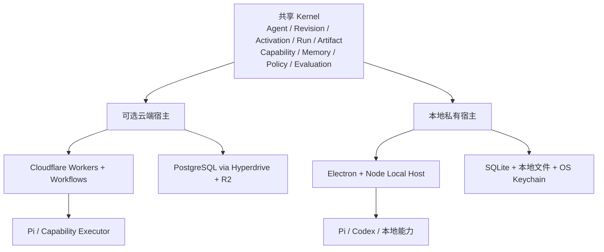

<div align="center">

# LoopEvo

### 闭合循环，让工作持续进化。

**一个把目标转化为可复用、可持续改进 Loop 的开源通用 Agent 平台。**

[English](./README.md) · [产品](./docs/design/core/product-and-architecture.md) · [架构](./docs/design/core/system-architecture.md) · [路线图](./docs/plans/roadmap.md)

</div>

> [!IMPORTANT]
> **状态：Pre-alpha / 设计阶段。** 仓库当前只有已采纳的产品、架构、UI、安全与路线图文档。下文的应用、运行时、Connector 和集成均为规划能力，不是已经实现的生产功能。

## LoopEvo 是什么？

告诉 LoopEvo 你想要什么。Agent 会调研问题、调用已有能力并完成工作；当任务需要重复或长期运行时，它会自动沉淀为 **Loop**。

```text
目标
→ Agent 调研并执行
→ 需要重复或恢复时形成可复用 Loop
→ 在本地私有或云端持续运行
→ 保存结果与来源
→ 评估质量、成本与风险
→ 在用户授权边界内持续改进
```

LoopEvo 是通用 Agent 平台。持续信息情报是第一个端到端 case，不是产品边界。

## 为普通用户设计，而不是为流程专家设计

用户只需要理解：

| 用户概念 | 含义 |
| --- | --- |
| **Agent** | 长期负责某类目标的 AI |
| **Loop** | Agent 已经变成重复或持续运行的工作 |
| **Activity** | Agent 正在做或已经做过什么 |
| **Result** | 有来源或验证依据的可用输出 |
| **Connection** | 对模型、数据源或交付目标的授权 |

Workflow Revision、Run、Checkpoint、Evaluation 和 Policy Decision 仍在内部保证可靠性，但它们只是渐进式详情，不是使用产品的前置知识。

## 本地私有或云端

| 模式 | 适用场景 | 数据路径 |
| --- | --- | --- |
| **本地私有桌面端** | 本地文件、浏览器、Coding Agent 和隐私敏感工作 | Agent、Run、Memory 和 Artifact 保存在设备；模型和 Source 请求由设备直达用户选择的 Provider；不要求 LoopEvo 云账号或同步。 |
| **LoopEvo 云端** | 全天候监控和定时工作 | Run 与 Artifact 保存在用户云账号，由云端访问已授权 Provider。 |

“本地私有”不等于断网或只使用本地模型。用户选择的 Prompt、文件片段和 Tool 结果可能直接发送给 OpenAI、Anthropic 或其他 Provider；LoopEvo 必须披露并限制范围。本地模型是未来选项，不是首期架构依赖。

本地与云端默认独立。Agent 和 Workflow Revision 可以显式导出；Secret、Connection、文件、Memory、Run 和浏览器状态不会静默同步。

## 产品原则

1. **Agent first，按需 Workflow：** 一次任务直接运行；只有需要重复、调度、等待或恢复时才形成 Workflow。
2. **外部简单，内部完整：** 用户概念保持少，内部保留 Revision、Run、Artifact、Capability、Memory、Policy 和 Evaluation。
3. **授权范围内自动执行：** 只读、可逆、已授权工作不重复审批。
4. **边界仍然存在：** 新凭据、私有范围、预算扩大、外部写入、删除和生产代码必须明确确认。
5. **证据先于置信：** 重要结果和变更指向来源、运行数据或可重复评估。
6. **进化是版本变更：** 低风险变更可自动评估、启用、观察和回滚，但权限和影响不能静默扩大。
7. **先验证 case，再抽象平台：** 信息流先验证 Kernel，第二个无关 case 再验证通用 SDK。

## 架构方向

LoopEvo 使用一个可移植共享内核和两个运行宿主：



### 关键边界

- Pi 是唯一原生 Agent Loop；Policy、持久 Run、Memory、Capability、Checkpoint 和 Artifact 由 LoopEvo 负责。
- Codex 与 Claude 是完整外部 Agent，通过小 Adapter 委派，而不是嵌入 Pi。
- Cloudflare Workflows 是首期唯一云端持久 Run 引擎；不同时引入 Agents SDK 或 Durable Objects 保存第二份 Session、Schedule 和恢复事实。
- PostgreSQL 是云端业务事实源，SQLite 是本地事实源；运行时历史不是产品审计数据库。
- 可移植 WorkflowRevision 通过 `Activation` 绑定 `local` 或 `cloud`，并固定所用 AgentRevision；导入另一端会创建独立 Activation。
- 首期代码保持少量责任区，不为每个领域对象创建服务或包。

规划中的 Foundation：

| 关注点 | 方向 |
| --- | --- |
| 共享语言与 UI | TypeScript、React、Vite |
| 原生 Agent | 由 LoopEvo Adapter 封装 Pi |
| 本地宿主 | Electron、Node、SQLite WAL、本地 Artifact Store、OS Keychain |
| 云端宿主 | Cloudflare Workers、Workflows、Hyperdrive、PostgreSQL、R2 |
| 能力 | Native Adapter、MCP、Skills、受控浏览器与命令 |
| 外部 Agent | Codex App Server；Claude API 或原生 Claude Code Companion |

持久执行、Policy、数据与 Adapter 边界见[系统架构](./docs/design/core/system-architecture.md)。

## 第一个垂直切片：自动信息流

用户可以提出：

> 持续跟踪 medo.dev、同类 AI 建站产品及其社区讨论；发现产品发布、设计趋势、功能诉求和抱怨；每天生成带来源简报，高价值信号及时通知。

Agent 应当：

1. 发现竞品、关键词、账号、社区、Feed 和权威站点；
2. 解释来源价值、授权、覆盖、费用和替代方案；
3. 区分历史回填、事件和增量采集；
4. 优先 Webhook、Stream、RSS 和可靠 Cursor，再使用自适应轮询；
5. 规范化、去重、聚类、排序并生成带来源总结；
6. 展示来源健康、覆盖缺口、告警和定期简报；
7. 根据反馈改进低风险查询、过滤、摘要和周期。

X 是 Alpha 必须验证的来源，接入方式必须是官方 API、用户授权或合同有效的 Provider。RSS 和定向公开网页提供低成本基础覆盖；Reddit、Bluesky、Facebook 和 Instagram 按真实价值、许可和成本加入，不承诺全平台覆盖。

如流等公司专用交付通过私有 Adapter 实现同一个 Delivery Contract，不进入开源核心的必选依赖。

## 低打扰自动化

LoopEvo 追求 **零不必要打扰，而不是零边界**。

在有范围、可撤销的 `PolicyGrant` 内，Agent 可以读取已授权数据、使用选定目录、模型、预算和交付目标，自动恢复失败，并应用经过验证的可逆改进。

新凭据或私有数据、权限或预算扩大、新的外部写入目标、删除或付款、不可逆账号变更，以及生成代码的生产发布必须停止并请求用户确认。

## 本地 Agent 集成

- **Codex：** 规划使用官方 Codex App Server 与稳定 stdio JSONL。ChatGPT 认证由 Codex 管理，LoopEvo 不复制认证文件；`codex exec --json` 作为降级路径。
- **Claude：** 正式后台路径使用受商业条款约束的 Claude Agent SDK 与 API Key 或支持的云 Provider。未取得 Anthropic 事先许可时，LoopEvo 不提供 Claude.ai 登录，也不消费 Free、Pro、Max 订阅；Companion 必须由用户在原生 Claude Code 中主动发起，不能通过后台 CLI 或代理驱动无人值守 Loop。
- **ACP：** 等第二个真实外部 Agent 需要统一协议后再实现。

## 路线图

1. **本地私有 Foundation：** 共享 Kernel、Electron Local Host、SQLite、Pi、API Key 模型 Connection、RSS Loop 和重启恢复。
2. **云端信息流 Alpha：** Cloudflare Workers / Workflows、PostgreSQL / Hyperdrive、R2、X、RSS、定向 Web 和交付。
3. **通用 Agent 验证：** 用第二个非信息流 case 验证 Kernel，并验证 Codex App Server，再冻结扩展 SDK。
4. **可验证进化：** Evaluation、最小变更、Grant 内自动启用、监测和回滚。
5. **受控 Coding Extension：** 通过 Codex 等可替换 Coding Agent 在沙箱生成候选能力。
6. **开放生态与团队：** 只在核心契约和治理经过真实使用后建设。

详见[完整路线图](./docs/plans/roadmap.md)和 [Foundation 实施计划](./docs/plans/foundation-implementation-plan.md)。

## 明确延后

- 本地模型下载、推理服务和 GPU 调度；
- 全社交平台覆盖或不受限制的抓取；
- 本地数据与凭据自动云同步；
- 完整拖拽画布、多 Agent Supervisor 和公共市场；
- 首版企业组织与 RBAC；
- 尚未完成运行与运维设计前的独立多用户自托管宿主；
- 没有真实需求前的 Cloudflare Agents SDK、Durable Objects、Queues、AI Gateway、Vectorize 和 Sandbox；
- 没有证据前的 Kafka、Redis、Elasticsearch、Kubernetes 和独立向量数据库。

## 项目状态

当前已有：

- 已采纳的产品、架构、UI、参考、安全和路线图文档；
- 中英文项目入口；
- Apache License 2.0 和仓库知识库治理。

尚未实现：

- Web、桌面端、API、身份、数据库和部署；
- 共享 Kernel、本地 Run Ledger、Pi Adapter 和 Cloudflare 宿主；
- 生产 Connector、外部 Agent Adapter、Evaluation 和进化运行时。

## 文档

- [产品定义与核心模型](./docs/design/core/product-and-architecture.md)
- [系统架构与技术基线](./docs/design/core/system-architecture.md)
- [参考项目与差异化](./docs/design/core/reference-landscape.md)
- [UI 设计体系](./docs/design/core/ui-design-system.md)
- [产品与工程路线图](./docs/plans/roadmap.md)
- [Foundation 实施计划](./docs/plans/foundation-implementation-plan.md)
- [安全与数据治理](./docs/reference/security-and-data-governance.md)
- [仓库上下文](./docs/reference/repository-context.md)

## 贡献

LoopEvo 仍足够早，核心决策很重要。提交代码前请阅读 [CLAUDE.md](./CLAUDE.md)、[docs/CLAUDE.md](./docs/CLAUDE.md)及相关事实源。不要把规划能力描述为已经实现，不要在没有第二个真实用途时增加抽象，也不要在未核验授权、条款、费用与删除方式时接入平台。

## 名称

**Loop** 表示从目标到结果和改进的循环；**Evo** 表示基于证据、受边界约束的进化。

## License

[Apache License 2.0](./LICENSE)
