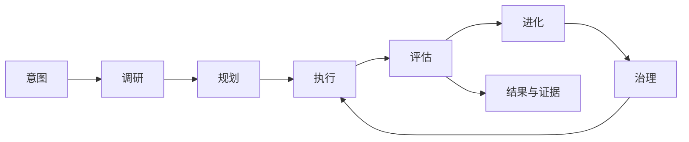
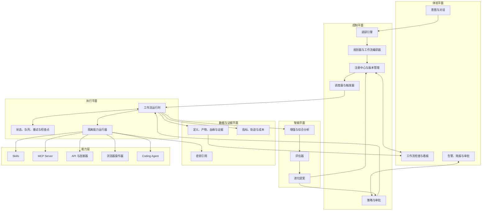
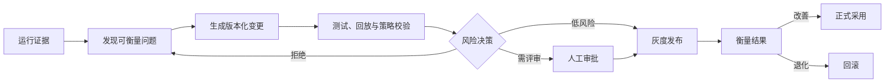

# 产品与核心架构

## 文档定位

本文记录 LoopEvo 已采纳的长期产品边界与目标架构，作为后续功能设计和技术选型的约束。

项目当前仍处于 **Pre-alpha / 设计阶段**。除“当前实现状态”明确列出的仓库资产外，本文描述的是目标系统应具备的能力，不代表运行时、连接器或界面已经实现。

## 产品定义

LoopEvo 是一个开源平台，目标是将自然语言意图转化为可治理、可复用、自进化的 AI 工作流。

用户描述目标、范围、周期、预算和成功标准；系统调研相关领域与可用能力，提出可检查的工作流，持久执行并保留证据，再根据评估结果生成受治理的改进版本。

LoopEvo 优化的是多次运行后的可靠结果，而不是单次 Agent 会话是否显得聪明。

## 要解决的问题

现有产品通常分别解决以下一部分：

- 对话式 Agent 擅长当前会话中的灵活推理，但有效过程经常随会话结束而消失；
- 自动化平台可以稳定重复执行，但用户需要自己发现信息源、配置工具和编排流程；
- Agent 框架提供开发基础能力，但状态、调度、治理、评估和运营仍需项目自行建设。

LoopEvo 聚焦它们之间的缺口：从自然语言意图发现工作流，并为该工作流提供持久执行、证据、评估、治理和版本进化能力。

通用 Agent 可以作为 LoopEvo 内部的推理或执行能力，现有自动化系统也可以作为下游执行器。LoopEvo 不以复制所有 Agent 和自动化工具为目标。

## 产品边界

LoopEvo 的目标是：

- 意图驱动的领域调研、能力发现和工作流规划层；
- 支持手动、定时和事件驱动任务的持久运行时；
- 管理工作流、能力、策略、证据和版本的注册体系；
- 基于运行结果和反馈的评估与受治理进化系统；
- 可组合 Skills、MCP Server、API、浏览器操作器和 Coding Agent 的能力平台。

LoopEvo 不是：

- 可以不经验证和审批任意改写生产系统的自治 Agent；
- 对所有通用聊天 Agent 或自动化产品的替代品；
- 自动获得所有第三方平台数据访问权的统一接口；
- 绕过平台条款、用户授权、数据许可或地区法律的社交媒体抓取器；
- 在项目早期就预设所有技术栈和部署形态的框架集合。

## 产品原则

1. **先有意图，再有流程图。** 用户描述结果，系统解释自己推导出的来源、步骤和约束。
2. **默认持久化。** 有效工作应当可调度、可重放、可观测和可版本化。
3. **证据比自信重要。** 结论与变更需要追溯到来源、运行记录和评估结果。
4. **进化必须受治理。** 改进需要先形成提案并经过验证，不能直接修改生产版本。
5. **能力保持模块化。** 每项能力声明输入、输出、权限、成本、延迟和失败方式。
6. **成本是系统约束。** 新鲜度、覆盖率、质量、延迟和费用需要联合优化。
7. **人始终保有控制权。** 高风险数据和操作必须经过明确授权与审批边界。
8. **用真实垂直场景验证平台。** 先完成范围小但稳定的端到端闭环，再扩展通用能力。

## 核心生命周期

### 1. 意图

通过自然语言获取用户期望结果、范围、周期、约束、预算和成功标准。系统应识别信息不足、目标冲突和高风险动作，而不是直接猜测。

### 2. 调研

研究领域中的实体、信息源、现有能力、访问方法、授权条件和风险，形成对用户可见的来源与工具提案。

### 3. 规划

将用户认可的提案编译成持久工作流，包括触发方式、类型明确的步骤、能力依赖、检查点、预算、策略和评估标准。

### 4. 执行

按需、按计划或由事件触发运行工作流，跨运行保留状态、重试、去重、产物、来源和证据。

### 5. 评估

衡量结果的有用性、准确性、新鲜度、覆盖率、可靠性、延迟和成本，将自动评估与用户反馈结合。

### 6. 进化

根据证据提出有针对性的版本变更，经过测试、历史回放、策略与预算检查后，再根据风险进入审批、灰度、采用或回滚流程。

## 目标系统分层

目标架构按职责分为五个平面，具体技术实现保持开放：

### 体验平面

负责意图输入、工作流解释、运行检查、结果查看、告警、简报和人工审批。用户应能看到系统选择了哪些来源、使用了什么能力、为何执行以及消耗多少资源。

### 控制平面

负责调研、规划、编译、版本、调度、策略和审批。它决定“允许执行什么”，不直接承载不受控的能力代码。

### 执行平面

负责隔离执行、状态、队列、重试、幂等和检查点。单个能力失败不应破坏整个系统状态，恢复行为必须可预测。

### 智能平面

负责内容增强、聚类、综合分析、结果评估和进化提案。模型输出本身不是事实，必须与来源、规则和评估证据关联。

### 数据与证据平面

负责工作流定义、产物、来源、血缘、指标、轨迹、成本和秘密引用。秘密值与普通运行证据分离存储。

## 持久工作流契约

工作流应是可版本化资产，而不是不透明聊天记录。目标契约至少包括：

- 意图、范围和可衡量的成功标准；
- 手动、定时或事件驱动触发器；
- 类型明确的执行图与能力依赖；
- 信息源选择理由、授权和访问约束；
- 状态、检查点、去重、重试和幂等语义；
- 预算、隐私、安全和审批策略；
- 评估套件与验收阈值；
- 来源、版本历史、发布状态和回滚目标。

具体 Schema、序列化格式和迁移机制需要在实现阶段另行设计并版本化。

## 能力层

能力通过显式契约接入，目标类型包括：

- **Skills：** 封装领域知识和可重复操作规程；
- **MCP Server：** 以标准方式暴露工具和上下文；
- **API 与连接器：** 对接经过授权的结构化服务；
- **浏览器操作器：** 在 API 不足且平台允许时执行网页交互；
- **Coding Agent：** 提出或实现缺失模块。

能力清单应描述用途、输入输出、权限、秘密、成本、延迟、失败模型、测试方法和兼容版本。Coding Agent 不能绕过工程控制，生成模块适用与人工代码相同的评审、测试、沙箱和发布规则。

## 受治理的进化

“自进化”表示基于证据持续提出可控制的改进，而不是静默修改生产系统：

进化对象可以包括信息源、执行周期、过滤器、提示词、模型、路由、评估器、工作流结构和能力代码。每个被采用的变更都必须具备证据、版本、审批依据和恢复路径。

## 首个端到端场景：主题情报

主题情报用于验证从意图到受治理进化的完整闭环。用户可以描述一个领域、品牌或竞品监控目标，系统计划完成：

1. 调研相关实体、竞品、关键词、社区和信息源；
2. 解释每个来源的价值、访问方式、成本和授权限制；
3. 持久化用户认可的采集与分析工作流；
4. 使用事件、游标或检查点进行增量采集和去重；
5. 对内容进行增强、聚类、排序、分析和总结；
6. 提供及时告警、定时简报和可搜索的证据视图；
7. 根据漏报、误报、成本和用户反馈改进覆盖率、周期、过滤器和综合分析。

潜在信息源包括 X、Reddit、Facebook、Instagram、Bluesky、RSS、公开网站和获得许可的数据供应商。实际覆盖取决于官方 API、账号授权、商业合同、平台条款、隐私要求和地区法律，不能在连接器实现前承诺完整覆盖。

该场景验证的是通用工作流能力，而不是把核心架构绑定为社交媒体抓取产品。同一闭环未来可以支持研究观察、学习计划、市场情报、技术变更跟踪和重复数据分析。

## 当前实现状态

当前已经完成：

- 产品定义、边界、原则和目标架构的文档化；
- 中英文 README；
- Apache License 2.0；
- 仓库知识库治理、协作、验证和安全基线。

当前尚未实现：

- 本文描述的应用界面、控制平面、执行平面、智能平面和数据平面；
- 工作流 Schema、运行时、调度、状态、评估与进化机制；
- Skills、MCP、API、浏览器或 Coding Agent 的生产适配层；
- 主题情报的数据采集、分析、告警、简报和检索能力。

实现状态变化时，必须依据代码和验证结果同步更新本节。

## 延后决策

以下决策需要实现阶段调研，不在核心架构文档中提前固定：

- 运行时语言、框架与仓库组织方式；
- 工作流 Schema 和执行引擎；
- 部署拓扑、多租户和身份模型；
- 数据库、队列、搜索、对象存储和可观测性技术；
- 连接器许可、平台适配和供应商选择；
- 评估数据集、模型供应商和自动审批阈值；
- 沙箱、秘密管理和生成代码的具体基础设施。

这些决策一旦被采纳，应进入对应的 `docs/plans`，实施后再回写稳定设计或参考规范。
