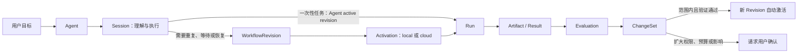

# 产品定义与核心模型

## 文档定位

本文是 LoopEvo 的产品事实源，回答“产品是什么、为谁服务、用户看到什么、内核必须保留什么”。技术实现见 `system-architecture.md`，界面规范见 `ui-design-system.md`，执行顺序见 `../../plans/roadmap.md`。

本文记录的是 **已采纳方向**。仓库仍处于 Pre-alpha / 设计阶段，除“当前状态”列出的文档资产外，本文能力尚未实现。

## 一句话定位

> LoopEvo 是一个开源的通用 Agent 平台：用户只需说明目标，Agent 就能调研、调用能力、形成可复用的 Loop，并在授权边界内根据结果持续改进。

自动信息流是第一个端到端验证场景，不是产品边界。LoopEvo 最终服务于持续研究、信息获取、学习、分析和重复运营等需要“做完一次，还要稳定做好下一次”的任务。

```text
目标
→ Agent 调研并执行
→ 必要时沉淀为可复用 Loop
→ 本地私有或云端持续运行
→ 保存结果与来源
→ 评估质量、成本和风险
→ 在授权边界内自动改进或请求一次必要确认
```

## 产品判断

现有产品通常只覆盖闭环的一部分：

| 产品形态 | 擅长 | LoopEvo 关注的缺口 |
| --- | --- | --- |
| 对话 Agent | 灵活完成当前任务 | 方法、状态和结果难以长期沉淀与运行 |
| 自动化平台 | 稳定重复确定流程 | 用户仍需理解节点、API、凭据和编排 |
| Agent 框架 | 提供模型、Tool 与 Loop | 面向用户的权限、持久执行、评估和进化需要自建 |
| 垂直情报产品 | 提供成熟数据与分析 | 价格高，方法和数据链难迁移到其他目标 |

LoopEvo 不以“更多节点”或“更长对话”为目标，而是把有效过程变成可以运行、解释、评估和改进的个人 Agent 资产。

## 目标用户

### 首要用户

首版面向不想学习 Agent 框架、API 和流程编排的个人用户、小型团队产品经理、增长人员、研究者和创作者。用户能描述结果、判断输出是否有用，并在需要时连接账号或数据 Provider。

产品默认替用户完成：

- 将自然语言目标拆成研究与执行步骤；
- 选择已有 Capability、Skill、Connector 或外部 Agent；
- 判断一次执行还是沉淀为长期 Loop；
- 选择事件、Webhook、增量游标或合理检查周期；
- 保存必要状态、来源、成本和失败恢复点；
- 根据反馈与运行证据改进低风险配置。

用户不需要先理解 Workflow、Run、Checkpoint、Evaluation 或 Approval 等内部概念。

### 扩展用户

- 开发者：增加 Capability、Connector、Skill 和外部 Agent Adapter；
- 自托管用户：完全掌控部署、数据与模型 Provider；
- 小型团队：在云端共享 Agent 和结果；
- 企业团队：未来接入组织身份、审计与更细权限，但不属于首版范围。

云端从第一天保留基础多用户隔离，每条根记录归属 `ownerUserId`；首版不建设组织、团队空间和复杂 RBAC。

## 产品形态

### 桌面端：本地私有模式

“本地”指 **不使用 LoopEvo 云端处理或保存业务数据**，不等于断网，也不要求本地模型：

- Agent、Loop、Memory、运行记录、凭据引用、文件和产物保存在用户设备；
- 模型请求由设备直接发送给用户选择的 OpenAI、Anthropic 或其他 Provider；
- LoopEvo 必须在发送前说明可能离开设备的数据范围；
- 默认不需要 LoopEvo 账号，不自动同步到云端；
- 本地定时任务依赖桌面后台进程和设备在线；
- 本地模型只进入远期规划，首版不为它增加架构复杂度。

桌面端可以读取用户明确选择的本地文件、操作受控浏览器或命令，并利用本机已安装的 Agent。Codex 通过官方 App Server 集成；Claude Code 订阅在取得 Anthropic 书面许可前不作为第三方后台 Provider。

### 云端：可选的全天候运行

云端适合需要设备关闭后仍持续执行的 Loop。托管形态优先使用 Cloudflare 技术栈，并提供基础账号隔离、预算和连接管理。云端不是本地模式的必经控制面。

### 可移植而不默认同步

Agent 与 Workflow Revision 使用开放、可导出的定义。用户可以显式导入或导出定义，但本地和云端默认独立：

- AgentRevision 与 WorkflowRevision 是可移植定义；
- `Agent.activeAgentRevisionId` 为一次性任务提供默认版本；
- `WorkflowRevision` 固定引用一个 `agentRevisionId`，`Activation` 只把 WorkflowRevision 绑定到 `local` 或 `cloud`；
- 在另一端激活导入的 WorkflowRevision 时创建新的 Activation，不共享运行 Lease；
- Connection、Secret、本地文件和浏览器登录态不随定义导出；
- 无法确认旧端已停止时，迁移界面必须提示重复副作用风险。

## 用户心智模型

普通用户只需要理解四个主要对象：

| 用户概念 | 用户理解 | 对应内部事实 |
| --- | --- | --- |
| `Agent` | 长期帮我完成某类目标的 AI | Agent、AgentRevision、Session、Memory、PolicyGrant |
| `Loop` | Agent 已沉淀、会重复或持续运行的任务 | WorkflowRevision、Trigger、Activation |
| `Activity` | Agent 当前或过去做了什么 | Run、Step、Evaluation、PolicyDecision |
| `Result` | 可使用、可追溯的输出 | Artifact、Provenance、DeliveryReceipt |

`Connection` 在需要授权数据源、模型或通知目标时出现。Workflow 图、Run Trace、Evaluation 和版本 Diff 只在“查看详情”中逐步展开，不成为新手的必经页面。

## 核心领域对象

| 对象 | 责任 | 边界 |
| --- | --- | --- |
| `Agent` | 长期身份、稳定目标和一次性任务默认 `activeAgentRevisionId` | 不保存某次运行状态 |
| `AgentRevision` | 不可变的 Instructions、默认模型、Skills、Memory 策略、能力与政策引用 | 修改产生新版本，不原地覆盖 |
| `Session` | 一次持续对话与上下文 | 不等于 Workflow 或持久业务状态 |
| `WorkflowRevision` | 需要重复、调度、等待或恢复时生成的不可变执行计划，并固定引用 `agentRevisionId` | 一次简单对话不必先编译 Workflow |
| `Activation` | 将一个 WorkflowRevision 绑定到执行目标、触发器与 `activeWorkflowRevisionId` | 不承担一次性 Agent 默认版本，也不代表跨本地和云端的全局 Lease |
| `Run` | 一次固定版本、可取消、可恢复的执行 | 不作为新版本设计稿 |
| `Artifact` | 结果、文件、数据、摘要或证据及其来源与派生关系 | 不把模型判断冒充原始事实 |
| `Capability` | 有类型输入输出、风险、成本、失败模型和执行位置的可调用能力 | 不拥有用户授权 |
| `Skill` | 教 Agent 如何完成一类任务的方法与指令 | 自身不授予文件、网络或账号权限 |
| `Connector` | 某类外部系统的实现 | 不保存某个用户的凭据 |
| `Connection` | 用户对模型、数据源或交付目标的一次授权实例 | 不扩大 Connector 声明的能力范围 |
| `Memory` | 有作用域、来源、时效和删除语义的事实或偏好 | 不表达 Policy、Checkpoint 或授权 |
| `PolicyGrant` | 用户预先授予的主体、动作、资源、目标、数据用途 / 保留、宿主、预算、有效期与撤销状态 | 不替代沙箱和真实 Provider 权限 |
| `Evaluation` | 针对 Run、Artifact 或候选版本的质量、成本与风险记录 | 不直接发布变更 |
| `ChangeSet` | 带 `targetType / fromRevisionId / toRevisionId` 的最小 Diff、依据、验证和回滚信息 | 不静默扩大权限、费用或外部影响 |

以下内容是内部记录，不建设为独立产品模块：

- `Trigger` 作为 WorkflowRevision 的组成部分；
- Approval 是 Policy 决策事件；
- Checkpoint、Lease、Fencing Token 和 Delivery Receipt 是运行不变量；
- `Activation.activeWorkflowRevisionId + history` 表达 Loop 发布与回滚，不额外建立 Release 实体；
- Loop 的 Agent Instructions 变化时，同时产生新 AgentRevision 与引用它的新 WorkflowRevision；
- 主题情报的 `SourceStrategy` 属于该 case 的 Artifact / 配置，不进入通用内核。

## Agent、Loop 与运行关系



## 自动化边界

LoopEvo 的目标是 **尽量不打断，而不是没有边界**。

### 默认自动执行

在用户已授予的 PolicyGrant 内，以下动作可以自动执行并留痕：

- 读取公开来源和用户已连接的数据；
- 访问用户已选定的文件夹或浏览器范围；
- 使用已批准的模型、预算和交付目标；
- 调整查询词、过滤器、摘要 Prompt 和合理检查周期；
- 修复可重试错误、从 Checkpoint 恢复或切换已授权的等价 Capability；
- 对低风险、可逆变更进行回放、评估、小范围启用和自动回滚。

### 必须打断

仅在以下边界请求用户：

- 新凭据、私有数据或新的本地文件范围；
- 扩大权限、预算、数据用途或保留期；
- 新的外部写入目标、公开发布或代表用户发送消息；
- 删除、付款、账号修改和其他不可逆动作；
- 将 Agent 生成的代码发布到真实执行环境；
- Provider 条款、授权或安全风险发生实质变化。

确认应尽量形成可复用 PolicyGrant，而不是每个 Tool Call 都重复询问。

### 自动进化约束

自动进化必须同时满足：

1. 产生不可变的新 Revision，并由 Run 固定使用版本；
2. 每次只改变一个可解释的参数组；
3. 基于真实反馈、历史回放或固定评估，而非模型自我感觉；
4. 不扩大权限、预算、数据用途和外部副作用；
5. 经过最小样本、冷却期和退化监测；
6. 可以自动停止和回滚；
7. 向用户展示简短、可追溯的变更记录。

生产代码、Connector 和新的高风险 Capability 永远使用普通软件发布门禁。

## 第一个垂直切片：自动信息流

用户可以描述：

> 持续跟踪 medo.dev、同类 AI 建站产品及其社区讨论，发现产品发布、设计趋势、功能诉求和抱怨；每天生成带来源的简报，高价值信号及时通知。

Agent 应自动完成：

1. 识别品牌、竞品、品类词、社区、账号、Feed 和权威站点；
2. 说明每个来源的价值、授权方式、覆盖、费用和替代方案；
3. 区分历史回填、事件订阅和增量采集；
4. 优先使用事件、Webhook、RSS 和可靠游标，再使用自适应轮询；
5. 规范化、去重、聚类、排序并生成带引用的结果；
6. 提供告警、定期简报、来源健康和覆盖缺口；
7. 根据漏报、噪声、费用和反馈自动优化低风险配置。

X 是 Alpha 必须验证的社交来源，必须通过官方 API、用户授权或合同有效的 Provider 接入。RSS 和定向公开网页提供低成本基础覆盖；Reddit、Bluesky、Facebook 和 Instagram 按价值、许可和成本逐步加入，不承诺“全网覆盖”。

公司版如流通知通过私有 Delivery Adapter 接入，不进入开源核心的必选依赖。

这个 case 必须验证通用的 Agent、Workflow、Capability、Memory、Artifact、Evaluation 和自动进化闭环。平台抽象只有在第二个非信息流 case 中继续成立，才升级为稳定 SDK。

## 价值指标

| 维度 | 关注指标 |
| --- | --- |
| 激活 | 从目标到首个有用结果、首个自动 Loop 的时间 |
| 结果 | 有用性、正确性、验证依据、完整性和纠错反馈 |
| 运行 | 成功、恢复、重复、积压、延迟和数据缺口 |
| 经济性 | 每个有用结果成本、Provider 成本和预算异常 |
| 自动化 | 无需打断完成率、重复审批率、自动改进收益与回滚率 |
| 安全 | 未授权动作、数据越界、删除完成度和审计完整性 |

没有真实基线前不承诺虚假 SLA。

## 明确不做

- 不要求用户从空白画布、节点库或 API 编排开始；
- 不把所有对话都强行转换为 Workflow；
- 不提供绕过登录、验证码、速率限制或平台条款的数据抓取；
- 不承诺免费或完整获得所有社交平台数据；
- 不在首版建设企业组织、复杂 RBAC、公共市场或多层 Agent Teams；
- 不把本地私有模式宣传为“所有数据都不离开设备”；
- 不为未来本地模型提前建设单独推理基础设施；
- 不允许 Agent 静默扩大权限、预算、数据用途或发布生产代码。

## 当前状态

当前已完成：

- 产品定位、双运行形态、核心模型、自动化边界和首个场景的文档化；
- 系统架构、外部参考、UI 设计、路线图和安全治理基线；
- 中英文 README、Apache License 2.0 和知识库治理规则。

当前尚未实现：

- Web、桌面应用、API、身份与数据存储；
- Pi Adapter、Workflow Runtime、Capability 和 Policy Engine；
- Codex、Claude、X、RSS、Web、通知和如流 Adapter；
- Evaluation、自动进化、Cloudflare 部署和本地私有运行时。

实现状态只能依据代码、测试和真实运行证据更新，不能由设计文档或原型直接改写。
