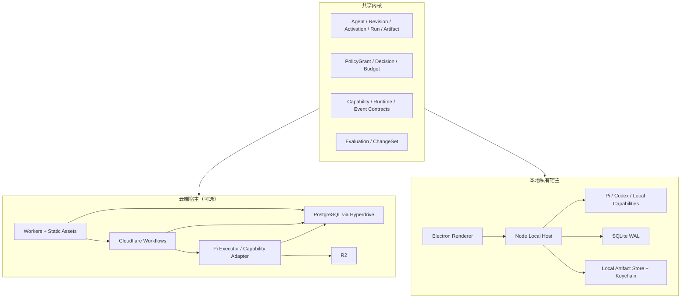

# 系统架构与技术基线

## 文档定位

本文记录 LoopEvo 已采纳但尚未实现的架构边界，以及需要由 Foundation Spike 验证的技术选择。产品模型见 `product-and-architecture.md`，外部依据见 `reference-landscape.md`，执行门槛见 `../../plans/roadmap.md`。

外部框架、服务能力、许可和条款会变化。真正引入依赖前必须重新核验并锁定版本。

## 架构结论

LoopEvo 采用 **共享内核 + 两个运行宿主**：

- 共享内核保存可移植领域模型、事件、Policy 与 Capability 契约；
- 云端宿主优先使用 Cloudflare Workers、Workflows、Hyperdrive 和 R2；
- 本地宿主使用 Electron、Node、SQLite、本地文件系统和操作系统钥匙串；
- Pi 是唯一原生 Agent Loop；Codex、Claude 等完整 Agent 通过 Adapter 委派，不伪装成 Pi 模型 Provider；
- 两端共享语义与契约测试，不强求使用同一种数据库、调度器或沙箱。

这能同时满足全天候云端执行和“不经过 LoopEvo 云端”的本地私有模式，又不把领域模型锁定在 Cloudflare 或桌面环境。

## 架构目标

- 自然语言目标可以直接执行，也可以在必要时沉淀为可解释的 Loop；
- 短任务、定时任务和长等待在对应宿主故障后可恢复；
- 每次 Run 固定 Agent、Workflow、Capability、模型和 Policy 版本；
- 文件、来源、运行、费用、结果和变更可以追溯；
- 用户在一个授权边界内尽量不被打断，边界外动作必须停止并请求授权；
- 云端和本地可以独立使用，默认不依赖跨端同步；
- 内核不泄漏 Pi、Cloudflare、Electron、模型或数据 Provider 的专有类型；
- 先用最少部署单元打通真实 case，再由测量结果引入新基础设施。

## 核心技术决策

| 关注点 | 已采纳方向 | 约束 |
| --- | --- | --- |
| 语言 | TypeScript | 共享 Schema、事件、UI 和 Adapter；版本在脚手架阶段锁定 |
| UI | React + Vite | Web 与 Electron Renderer 尽量复用；不为营销页引入第二套框架 |
| 原生 Agent | Pi | 先验证 Node 与 Workers 兼容性；通过 LoopEvo Adapter 隔离 |
| 云端执行 | Cloudflare Workflows | 唯一云端持久 Run 引擎，负责等待、重试和恢复 |
| 云端入口 | Cloudflare Workers + Static Assets | 一个应用承载 Web、API、SSE、Webhook 和中心调度入口 |
| 云端事实源 | PostgreSQL via Hyperdrive | 唯一业务事实源；Alpha 使用关闭查询缓存的 Binding，Workflows 状态不是长期审计库 |
| 云端大对象 | R2 | 保存原始页面、附件、截图和大 Artifact；小结果可直接存数据库 |
| 本地桌面 | Electron | Main 只管理窗口与受控 IPC；`utilityProcess.fork` 启动 Local Agent Host |
| 本地事实源 | SQLite WAL + 文件系统 | SQLite 保存结构化事实，内容寻址文件保存大 Artifact |
| 本地秘密 | OS Keychain | 不复制 Codex / Claude 自身凭据，不在 SQLite 明文保存 Secret |
| 能力 | Native Adapter、MCP、Skills、浏览器与受控命令 | Capability 是权限边界，Skill 不是权限 |
| 观测 | 结构化 Domain Event，后续映射 OpenTelemetry | OTel 不是领域事实源 |

暂不进入首版：Cloudflare Agents SDK、Durable Objects、Queues、AI Gateway、Vectorize、独立消息系统、Kubernetes、微服务拆分和完整工作流画布。

## 逻辑架构



### 稳定边界

- **共享内核** 只定义业务语义和端口，不引用 Cloudflare、Electron 或 Provider SDK。
- **宿主** 负责调度、持久化、秘密、沙箱、网络和进程生命周期。
- **Pi** 负责推理与 Tool 选择，不拥有业务授权、持久 Run、Checkpoint 或产品 Memory。
- **Capability Executor** 执行 Pi 请求的 Tool；完整外部 Agent 委派本身作为受控 Capability，在限定 Workspace / Sandbox 内运行并把内部审批映射到 Policy。
- **PostgreSQL / SQLite** 分别是对应云端或本地宿主的唯一业务事实源。
- **Artifact Store** 保存大对象；数据库保存哈希、来源、类型、大小、保留和访问策略。
- **UI** 只读取领域投影，不把聊天消息或 Agent 内部事件当最终事实。

## 最小实现边界

首版保持五个代码责任区，不预先拆大量包：

```text
apps/desktop          Electron UI 与本地 Host
apps/cloud            Worker UI/API、Workflows 与云端 Adapter
packages/kernel       领域 Schema、Policy、事件与宿主端口
packages/runtime-pi   Pi Adapter 与统一 Agent Event
cases/info-flow       RSS / Web / X、分析、摘要与交付
```

共享 UI 在第二个宿主真正复用时再从应用中提取；Connector SDK、ACP Adapter、Evaluation SDK 和独立 Worker 包也遵循“第二个真实实现后再抽象”。逻辑边界必须清楚，但不等于每个概念都要成为部署服务或 npm 包。

## 运行模型

### 一次任务与 Loop

Session 可以用 `Agent.activeAgentRevisionId` 直接启动一次 Run。只有任务需要重复、调度、事件触发、跨进程等待或稳定恢复时，才生成固定引用 `agentRevisionId` 的 `WorkflowRevision`；`Activation` 只激活 WorkflowRevision。

```text
Session
├── one-shot Run
└── WorkflowRevision → Activation(local | cloud) → many Runs
```

Revision 是可导出的定义，Activation 是 Workflow 的目标相关部署状态。一个 WorkflowRevision 可以在不同设备或云端产生独立 Activation，系统不虚构跨断开环境的全局 Lease。Loop 改变 Agent Instructions 时，同时生成新 AgentRevision 和引用它的新 WorkflowRevision。

### Run 生命周期

```text
queued → running → waiting → running → succeeded
                  ├───────────────→ failed
                  ├───────────────→ cancelled
                  └───────────────→ policy_blocked
```

这张图只描述 `Run.executionStatus`。云端派发另有 `Run.dispatchStatus = pending | dispatched | reconcile_required`，不能混入执行状态；本地 Run 不需要该字段。`Step` 使用自己的 `pending | running | waiting | succeeded | failed | cancelled`。外部副作用结果属于 `EffectReceipt.status = in_flight | succeeded | failed | delivery_unknown | compensated`；`delivery_unknown` 会让当前 Step 和 Run 以明确错误码失败并等待人工对账，不是 Run 状态，也不能自动重放。

Run 启动时固定：

- `agentRevisionId` 与可选 `workflowRevisionId`；
- 可选 `activationId`、触发原因与目标宿主；一次性 Run 没有 Activation；
- Capability、Skill、Prompt、Model 和 PolicyGrant 版本；
- 输入 Artifact、预算、超时、重试和保留策略。

每个外部副作用使用稳定 `effectId`，但系统只能达到 Provider 声明的保证级别。支持幂等键或可查询回执时可以安全自动重试；结果未知且 Provider 两者都不支持时，将 Effect Receipt 标为 `delivery_unknown`，当前 Step / Run 失败并停止重放。Run、Step、Artifact 和 Effect Receipt 进入宿主事实库；执行引擎内部历史只用于恢复。

## 云端宿主

### 首版拓扑

```text
Cloudflare Workers + Static Assets
├── Web / API / SSE / Webhook
├── 一个中心 Schedule Tick
├── Cloudflare Workflows：持久 Run、等待、重试、恢复
├── PostgreSQL via Hyperdrive：唯一业务事实源
├── R2：大 Artifact 与原始证据
└── Pi / Capability Executor：Workers 内或经验证的 Container Adapter
```

Cloudflare Workflows 是唯一云端 Run 引擎。Cloudflare Agents SDK、Durable Object Alarm 和其他调度器不得同时拥有业务 Session、Memory、Schedule 或恢复状态。

### 调度

不为每个 Loop 创建独立 Cron：

1. 一个 Worker Cron 周期性领取 PostgreSQL 中到期的 Activation；
2. 使用 `FOR UPDATE SKIP LOCKED` 有界、公平地领取；同一事务插入唯一 `(activationId, scheduledFor)`、`executionStatus = queued`、`dispatchStatus = pending` 的 Run，并推进 `nextRunAt`；
3. 事务外以该 `runId` 创建 Workflows 实例，成功后写入 `workflowInstanceId / dispatchedAt`；
4. 后续 Tick 重试过期且 `dispatchStatus = pending` 的记录；不确定结果先转 `reconcile_required` 并查询实例，不能盲目创建；PostgreSQL 唯一约束负责永久逻辑幂等，Workflow ID 只负责实例保留期内去重；
5. `already exists` 只有在对账确认属于同一 Run 后才视为成功；
6. 每个外部副作用使用 `runId + stepId + effectId` 去重。

Tick 必须限制单次领取量和运行时间，并记录 backlog、最老待执行时间、用户公平性、时区 / DST 与 catch-up 结果，不能无界扫描；截至调研基线，`createBatch()` 每批最多 100 个实例，实施时必须重新核验。事件和 Webhook 可以直接创建 Run，但必须校验签名、时间窗、重放 ID 与 Payload Schema，并经过相同幂等与 Policy 路径。Workflows 的短期状态保留不替代 PostgreSQL 的长期运行与审计记录。

### Pi 执行位置

Phase 1 前置 Spike 必须验证 Pi 在 Workers 运行时的包兼容，以及真实 `AgentRunWorkflow` 的持久恢复粒度。模型 Turn、Capability Request、Capability Result 与 Checkpoint 必须形成明确的 Workflows Step 边界；分别在模型返回后、Tool 执行前和 Tool 执行后注入失败并恢复。Workflow Payload 只传 ID，大内容进入 R2；Pi 状态必须转换为可持久化的 LoopEvo Runtime Checkpoint，而不是只保存在进程内。

截至调研基线，Workflows 付费计划每 Step 默认 30 秒 CPU、可配置到 5 分钟，Payload 与普通 Step Result 上限 1 MiB，完成实例最多保留 30 天；实现 Spike 必须重新核验这些限制，并验证最大 Turn、R2 外置、429 退避和取消。验证结果只有两种：

- 兼容：Pi Executor 直接运行在 Worker / Workflow Step；
- 不兼容：使用 Cloudflare Container 或独立 Node Executor 实现同一个 `AgentRuntimeAdapter`，但仍由 Workflows 驱动，不形成第二个 Run 引擎。

不得为了提前兼容两条路径同时构建两套生产 Executor。

### 按需增加的 Cloudflare 能力

| 能力 | 何时增加 |
| --- | --- |
| Browser Run | 官方 API、RSS 和静态 HTTP 不足，且页面访问被允许 |
| Sandbox / Containers | Pi 兼容 Spike 明确需要，或首次允许云端运行用户 / 模型生成代码 |
| Queues | 出现真实采集突发、扇出或独立投递重试需求 |
| AI Gateway | 需要多 Provider 路由、统一限流、缓存或跨模型成本治理 |
| Durable Objects | 出现多客户端 WebSocket Presence 或单写者协调需求 |
| Vectorize | 固定检索评测证明 PostgreSQL 搜索无法满足需求 |

若引入 Durable Objects，其状态只能是可重建的连接态或缓存；PostgreSQL 仍是业务事实源。Cloudflare Container 自身要求的 Durable Object Binding 属于基础设施例外，也不得保存 Session、Schedule 或业务事实。Container Spike 还必须验证冷启动、取消、并发、健康和成本。若引入 AI Gateway，默认关闭 Prompt / Response Payload 日志。

## 本地私有宿主

### 进程边界

```text
Electron Renderer（无 Node、无文件和进程权限）
        │ typed preload API
Electron Main（窗口、生命周期、Keychain、IPC 路由）
└── Utility Process（`utilityProcess.fork`）：Local Agent Host
    ├── Scheduler / Run Ledger
    ├── Policy / Capability Executor
    ├── SQLite WAL
    ├── Content-addressed Artifact Store
    └── OS Keychain / Provider-owned credentials
```

Renderer 只加载打包资源，开启 Context Isolation 与 Sandbox，关闭 Node Integration，保持 `webSecurity`，配置 CSP，并禁用 `webview`、未授权导航和新窗口。所有 IPC 校验 sender / frame、Origin 与输入 Schema；preload 不暴露通用 `exec`、任意路径读取或原始 Electron API，Secret 永不返回 Renderer。外链只允许明确协议和域名。

Electron Main 只管理窗口、生命周期、Keychain 与 IPC 路由；首版固定使用 Electron `utilityProcess.fork` 启动 Local Agent Host，不并行维护 Child Process 路径。Host 根据 Capability Manifest 和 PolicyGrant 限制路径、域名、命令、资源与副作用，进程崩溃不能获得更大权限；只有 Spike 证明 Utility Process 无法满足已记录约束时，才以新决策替换实现。

### 本地持久执行

本地不复制 Cloudflare Workflows，而是实现最小 Run Ledger：

- SQLite 保存 Trigger、`nextRunAt`、Run、Step、Attempt、Checkpoint 和 effect receipt；
- 单进程 Scheduler 使用租约领取到期 Activation；
- 每步完成后先持久化结果与下一状态，再继续执行；
- 进程重启后从最近 Checkpoint 恢复；
- 相同 `runId / effectId` 重放不会重复副作用；
- 设备休眠或进程停止后不承诺准时执行，恢复时按 Policy 决定补跑或跳过。

只有真实工作流证明需要更复杂的本地编排后，才评估额外引擎。

### 数据边界

- 默认不登录 LoopEvo 云端，不建立自动同步通道；
- Agent、Memory、Run、Artifact 和本地索引只在设备；
- 模型请求和信息源请求由设备直连相应 Provider；
- UI 必须区分“发送给模型 Provider”和“上传到 LoopEvo 云端”；
- 导出默认不含 Secret、Connection Token、本地路径内容和浏览器状态；
- 删除覆盖 SQLite、Artifact、派生索引和可控缓存。

本地模型不是首版依赖。当前只保留模型调用所必需的 Provider Adapter，不建设本地推理服务、模型下载器或 GPU 调度。

## Agent Runtime

### Pi：原生运行时

Pi 提供模型适配、Agent Loop、Tool Calling、事件与上下文管理。LoopEvo 自己负责 Policy、持久 Run、Memory、Capability、Checkpoint、成本和沙箱。

Pi 类型不能出现在领域 Schema、数据库或 UI 协议中。实现必须锁定经过验证的精确版本，并用夹具测试升级兼容。

### 外部 Agent：委派而不是嵌套

Codex 和 Claude Code 本身拥有 Agent Loop、工具、权限和 Session，不作为 Pi 的普通模型 Provider。LoopEvo 的 Adapter 方法不是上游原生 API，而是统一生命周期契约：

```ts
interface AgentRuntimeAdapter {
  probe(): Promise<RuntimeStatus>;
  start(input: RunInput): AsyncIterable<AgentEvent>;
  resume(input: RuntimeResumeInput): AsyncIterable<AgentEvent>;
  cancel(runId: string): Promise<void>;
}

type RuntimeResumeInput =
  | { type: "capability_result"; runId: string; checkpoint: RuntimeCheckpoint; callId: string; result: CapabilityResult }
  | { type: "policy_decision"; runId: string; checkpoint: RuntimeCheckpoint; requestId: string; decision: PolicyDecision };
```

Adapter 在首次启动、每个暂停点和完成前输出 JSON 可序列化、带版本的 `RuntimeCheckpoint`；Checkpoint 不包含 Secret，并能通过规范化 Runtime History 或 Provider Session ID 在进程重启后恢复。交互 Run 可引用发起它的产品 Session，计划 Run 不依赖产品 Session。Adapter 完成时只返回可序列化结果，由 Coordinator 写成带 Provenance 的 Artifact。未知上游事件进入脱敏 Runtime Telemetry；影响控制流的未知事件必须失败关闭，不能伪装成普通 Domain Event。

首批方向：

| Adapter | 定位 |
| --- | --- |
| `PiRuntimeAdapter` | LoopEvo 原生 Agent Loop |
| `CodexAppServerAdapter` | 正式本地 Coding Agent / 受控文件与命令能力；使用官方 stdio JSONL |
| `ClaudeApiAdapter` | 可选商业条款 Adapter；只使用用户 API Key 或 Anthropic 支持的云 Provider |

Codex 委派本身是一项 Capability，运行在宿主限定的 Workspace、Sandbox 和网络范围内。App Server 的命令 / 文件审批请求映射为 LoopEvo Policy Decision，并通过 `policy_decision` 响应返回 Codex：Grant 内自动批准，越界 `ask / deny`。Codex 内部 Tool 由 Codex 自己在该 Sandbox 内执行，不伪装成 LoopEvo CapabilityResult，也不能默认使用 `danger-full-access` 或无条件批准。

`CodexAppServerAdapter` 将 LoopEvo 生命周期映射到 App Server 初始化、`account/read`、由 Codex 管理的 ChatGPT / Device Code 登录、Thread、Turn、取消、账号变化与登出。LoopEvo 不读取或复制 `~/.codex/auth.json`，不注入实验性外部 Token，并用真实 `clientInfo` 标识自身。使用用户已安装 Codex 时先探测版本并检查受支持范围；只有 LoopEvo 自行分发二进制时才锁定精确版本。

`codex exec --json` 只是受限功能降级，不假设具备 App Server 的双向审批和账号事件。它只能在安全 Sandbox 内运行兼容任务，并向上层暴露 degraded Capability。

未经 Anthropic 事先批准，第三方不允许提供 Claude.ai 登录或路由 Free、Pro、Max 额度。Claude Agent SDK 受 Anthropic Commercial Terms 约束，采用前逐版本审查；正式后台路径只使用 API Key、Bedrock、Vertex 等允许方式。

### 入站 Companion 与 ACP

`ClaudeCompanionBridge` 不实现 `AgentRuntimeAdapter`。它只通过 MCP、Skill、Plugin 或安装入口，让用户在原生 Claude Code 中主动发起、观察和控制对 LoopEvo 的调用；不得通过 `claude -p`、后台代理或定时任务消费订阅，因此不能成为无人值守 Loop 的模型后端。

ACP 是后续兼容协议；出现第二个真实外部 Agent 需求后再实现通用 Adapter。协议只解决通信，不扩大 Capability 或 Policy。

## Capability、Skill 与 Connection

每个 Capability Manifest 至少声明：

- 稳定 ID、版本、来源、许可和维护者；
- 有类型输入、输出和错误；
- 可运行宿主：`local`、`cloud` 或两者；
- 文件、进程、网络、数据和 Credential 范围；
- 风险级别、费用、延迟、并发、超时与重试；
- 是否产生副作用、重试模式、Provider Idempotency、Receipt 查询和补偿 Capability；这些是正交能力，不能压成一个互斥枚举；
- 健康检查、契约测试、保留与删除语义。

Skill 只提供方法和上下文；使用 Skill 不自动授予其描述的 Capability。Connector 是外部系统的实现，Connection 才是某位用户的授权实例。MCP 也是能力协议，必须经过同一个 Manifest、Policy 和沙箱代理。

## Policy 与低打扰自动化

Policy 决策顺序：

```text
宿主沙箱可达
→ Capability 已声明
→ Connection 有效
→ PolicyGrant 覆盖 subject、action、resource、destination、数据用途 / 保留、目标宿主、预算窗口、有效期与撤销状态
→ allow / ask / deny
```

Host 从已验证的交互 Session 或计划 Run 持久事实构造 `PolicyContext`，包含 owner、Agent、Run、subject、targetHost、数据用途 / 保留和当前 / 预计预算；模型与请求 Payload 不能指定这些字段。Policy Engine 根据 request、context 和有效 Grants 生成 Decision，Host 持久化绑定 `decisionId / requestHash / runId / expiry` 的单次 Authorization Record，再构造 `AuthorizedCapabilityCall`；Capability Executor 只接受该对象。同一受信进程内通过回读并原子消费记录防止伪造和重放；跨进程或服务信任边界时再附加并验证 MAC。`ask` 只用于边界扩张和高风险动作；批准后尽量生成有范围和有效期的 PolicyGrant，后续同类动作自动执行。无人值守 Run 不继承交互 Session 的临时权限。

低风险进化生成新 Revision，在历史回放或固定评估通过后可自动激活；权限、预算、数据用途、外部写入和代码发布的扩大始终停止并请求确认。

## 数据、一致性与 Artifact

### 事实源

云端 PostgreSQL 与本地 SQLite 使用同一领域标识和迁移语义，但不要求相同物理 Schema。各自保存：

- User / Agent / Revision / Session；
- WorkflowRevision / Activation / Run / Step；
- Capability / Connection / PolicyGrant；
- Memory / Artifact Metadata / Evaluation / ChangeSet；
- Checkpoint / Lease / Effect Receipt / Audit Event。

云端所有根记录带 `ownerUserId`，它只能来自验证后的 Session，禁止由请求 Payload 指定。Alpha 只使用关闭查询缓存的 Hyperdrive Binding；认证撤销、Policy、预算、Lease、Checkpoint 和读后写路径不能使用缓存。Hyperdrive 使用 Transaction Pooling，RLS 上下文必须在每个显式事务内通过 `SET LOCAL` 设置，不能依赖连接级 Session 状态。Scheduler / Workflow 使用独立数据库角色，并在服务查询中显式限制 owner。正式团队租户模型后续另行设计。

### Artifact

Artifact 自带 Provenance：来源、时间、哈希、生成步骤、输入引用、派生关系和保留策略。主题情报中的原始帖文、网页和摘要只是 Artifact 的不同角色，不在内核建立专属 Evidence 模块。

数据库与对象存储无法原子提交时，使用 `pending → available`：先在事务中插入 pending 元数据和稳定对象键，再上传到私有 Bucket，校验哈希后在事务中标记 available 并推进 Checkpoint。引用对象不可读时不得提交进度；后台清理超时 pending、对账孤儿对象，并用 Tombstone 记录删除，不新增独立 Artifact 服务。

### 幂等

```text
activationId + runId + stepId + effectId
```

物理 Attempt 不改变 `effectId`。通知和外部写入保存 Effect Receipt 与 Provider Receipt；支持 Provider Idempotency Key 或可查询回执时，未知结果可以安全重试。两者都不支持时，发送前将 Effect Receipt 记为 `in_flight`，响应不明则转为 `delivery_unknown`，让当前 Step / Run 失败并停止自动重放；若声明可补偿，只能调用显式补偿 Capability。取消不能撤回已经发生的副作用。

## 信息流 case 的增量采集

该语义属于 `cases/info-flow`，不进入所有 Agent 的通用模型。

优先级：Event / Webhook / Stream → 可靠 Cursor → 自适应轮询 → 固定轮询。

每个 Source 保存：

- `durableCheckpoint` 与当前 Run 的分页 Checkpoint；
- `lastSuccessAt`、`nextCheckAt`、退避、配额和覆盖健康；
- 查询窗口、重叠窗口、late-arrival 和删除策略；
- 单次预算、最大页数与停止条件。

同一 Source 的采集使用租约和递增 fencing token。旧 Run 恢复后不能覆盖新 Checkpoint、释放新租约或删除新状态。Provider 不支持事件或增量时，系统根据新鲜度、价值、配额和历史更新频率调整检查周期，并明确成本与漏报风险。

## 评估与自动进化

```text
Observe
→ ChangeSet with minimal diff
→ Static checks
→ Replay / Evaluation
→ Policy and budget checks
→ Auto activate in grant OR ask once
→ Monitor
→ Keep or rollback
```

Evaluation 首版是 Run / Artifact 上的简单记录，不建设独立评估平台。ChangeSet 首版可以存为新 Revision 的 `targetType + fromRevisionId + toRevisionId + diff + evidence`。只有第二个 case 证明需要后再抽象公共 SDK。

## 测试基线

- Kernel：Schema、Revision、Activation、Policy、状态机、预算和幂等；
- Host Conformance：同一测试验证云端和本地对 Run、Artifact、Capability、Policy 的共同语义；
- Local：进程停止 / 恢复、设备错过周期、SQLite 事务、恶意 Renderer、IPC sender / Schema、路径与命令逃逸、导航、文件与 Keychain 边界；
- Cloud：身份 / Session 撤销、关闭缓存的 Hyperdrive、Run 事务派发、Workflows Step 故障注入、调度 backlog、PostgreSQL 与 R2 对账；
- Pi：事件映射、Tool 暂停 / 恢复、取消、成本和版本升级夹具；
- External Agent：Codex 版本范围、账号生命周期、认证不复制、命令 / 文件审批、路径 / 网络越界、取消和 degraded CLI 降级；
- Capability：allow / ask / deny、Authorized Call、防伪造、沙箱、凭据、费用和各 Provider 副作用保证；
- Info Flow：分页、Cursor 失效、late arrival、删除、租约接管和 Checkpoint CAS；
- E2E：目标 → RSS / X → 有来源结果 → 定时恢复 → 反馈 → 低风险变更与回滚。

## Build / Reuse / Buy

| 策略 | 内容 |
| --- | --- |
| 自研 | 共享 Kernel、本地 Run Ledger、Policy、Artifact、Evaluation / ChangeSet、用户体验 |
| 复用 | Pi、Electron、SQLite、Cloudflare Workers / Workflows / Hyperdrive / R2、React、MCP SDK |
| 委派 | Codex App Server、可选 Claude Agent SDK、后续 ACP Agent；Claude Companion 属于入站互操作 |
| 接入或购买 | LLM、搜索、授权社交数据、浏览器、通知和企业身份服务 |

LoopEvo 不自建社交数据网络，也不通过技术手段绕过 Provider 授权。

## 重新评估门槛

- **新包或服务：** 只有第二个实现或已测故障证明需要，才抽象或拆分；
- **Cloudflare Agents SDK / DO：** 只有真实多端实时连接或单写者协调需求；
- **Queues：** 只有 Workflows 与数据库无法承担已测扇出或突发；
- **AI Gateway：** 只有多模型路由、统一配额或观测收益明确；
- **独立搜索 / Vector：** 只有固定检索评测证明数据库方案不足；
- **本地模型：** 只有用户需求、模型质量和安装维护成本形成证据；
- **多 Agent Supervisor：** 只有单 Agent 在可独立并行任务上稳定受限；
- **完整画布：** 只有渐进式 Inspector 无法满足理解和修改需求。

## 主要官方来源

- [Pi](https://github.com/earendil-works/pi)
- [Cloudflare Workers](https://developers.cloudflare.com/workers/)、[Workflows](https://developers.cloudflare.com/workflows/)、[Hyperdrive](https://developers.cloudflare.com/hyperdrive/)、[R2](https://developers.cloudflare.com/r2/)
- [Cloudflare Workflows limits](https://developers.cloudflare.com/workflows/reference/limits/)、[D1 limits](https://developers.cloudflare.com/d1/platform/limits/)
- [Cloudflare Workers API for Workflows](https://developers.cloudflare.com/workflows/build/workers-api/)、[Hyperdrive query caching](https://developers.cloudflare.com/hyperdrive/concepts/query-caching/)、[connection pooling](https://developers.cloudflare.com/hyperdrive/concepts/connection-pooling/)
- [Cloudflare Browser Run](https://developers.cloudflare.com/browser-run/)、[Sandbox SDK](https://developers.cloudflare.com/sandbox/)、[Containers](https://developers.cloudflare.com/containers/)
- [Codex App Server](https://learn.chatgpt.com/docs/app-server)、[Authentication](https://learn.chatgpt.com/docs/auth)、[Non-interactive mode](https://learn.chatgpt.com/docs/non-interactive-mode)
- [Claude Agent SDK](https://code.claude.com/docs/en/agent-sdk/overview)、[Claude Code headless mode](https://code.claude.com/docs/en/headless)
- [Agent Client Protocol](https://agentclientprotocol.com/overview/introduction)
- [Electron Security](https://www.electronjs.org/docs/latest/tutorial/security)
- [PostgreSQL](https://www.postgresql.org/docs/)、[SQLite WAL](https://www.sqlite.org/wal.html)
- [MCP TypeScript SDK](https://github.com/modelcontextprotocol/typescript-sdk)
