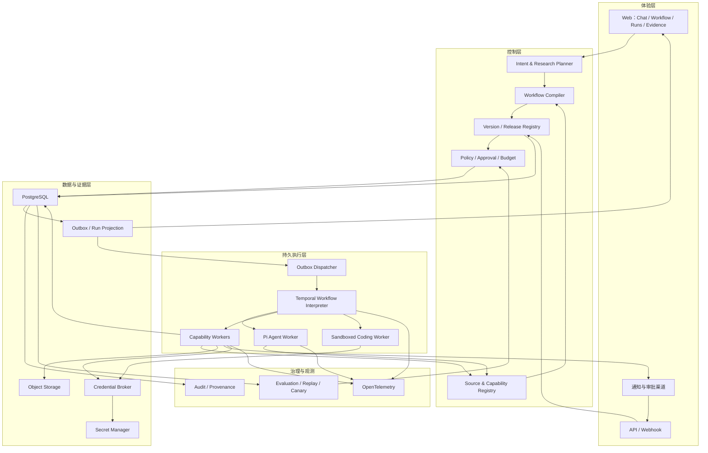
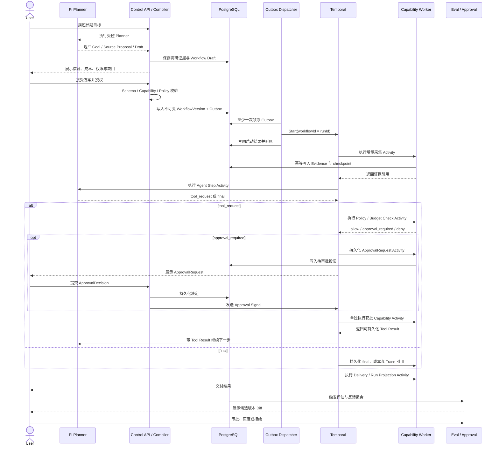

# 系统架构与技术基线

## 文档定位

本文记录 LoopEvo 已采纳但尚未实现的架构边界，以及需要由 Phase 0 Spike 验证的暂定技术选择。产品定义见 `product-and-architecture.md`，竞品依据见 `reference-landscape.md`，验证门槛与交付顺序见 `../../plans/roadmap.md`。

调研基线为 2026-08-01。外部项目版本、许可和托管能力会变化，真正引入依赖前必须重新核验并锁定版本。

## 架构目标

系统必须同时满足：

- 自然语言目标可以形成可审查的声明式工作流；
- 秒级任务和跨天、跨月等待都能在进程故障后恢复；
- 每次运行固定工作流、模型、能力、策略与凭据引用版本；
- 原始证据、采集检查点、运行状态、费用与结论可以追溯；
- Agent 只能在授权范围内判断和提案，不能绕过策略执行副作用；
- 单机开发、自托管和未来托管版本共享核心语义；
- 核心模型不泄漏 Pi、Temporal、模型或数据 Provider 的专有类型。

## 核心决策

架构职责与隔离原则是稳定设计；具体框架在 Spike 通过前属于 **provisional planned choice**，不得写入依赖或实现状态。

| 决策 | 当前首选 | 理由 |
| --- | --- | --- |
| 主语言 | TypeScript | Pi、Temporal SDK、Web 与连接器可共享类型和工具链 |
| 产品形态 | 模块化单体 + 独立 Worker | 保持边界和故障隔离，不提前拆微服务 |
| Web | React / Next.js | 支持官网、应用、服务端入口和流式交互；实现前再锁版本 |
| Agent 内核 | Pi（暂定） | 复用模型适配、Agent Loop、工具调用、事件和上下文管理 |
| 持久执行 | Temporal TypeScript SDK（暂定） | 跨进程恢复、Durable Timer、Signal / Update、Schedule 和版本化语义是核心需求 |
| 产品事实源 | PostgreSQL | 保存项目、版本、运行投影、采集检查点、证据元数据、评估和审批 |
| 大对象 | S3 兼容对象存储 | 保存原始响应、页面快照、附件和大体积派生产物 |
| 领域事件 | PostgreSQL Outbox | 保证产品写入与事件发布一致；没有规模证据前不引入 Kafka / NATS |
| 浏览器 | Playwright Worker | 确定性浏览器能力；优先级低于官方 API 和授权 Connector |
| MCP | 官方 TypeScript SDK + 权限代理 | MCP 是能力协议，不是权限边界 |
| 可观测 | OpenTelemetry | 用开放协议关联 Workflow、Run、Agent、Tool、成本和审批 |
| UI 基础 | Tailwind CSS + Radix primitives | 快速建立一致 Token、无障碍基础与可维护组件；不复制 Wegic 资产 |

### 为什么暂定 Temporal，而不是 Trigger.dev

LoopEvo 的核心是持久、可等待、可审批、可恢复和可版本化的长期工作流。Temporal 的 Event History、Durable Timer、Signal / Update 和 Schedule 直接对应这些语义，开源自托管与托管形态保持同一核心模型。它的学习和运维成本更高，但这是核心复杂度，不是为未来规模预建。

[Trigger.dev](https://trigger.dev/docs) 的 TypeScript 开发体验、Dashboard 和 Realtime 很适合快速后台任务；但其[自托管说明](https://trigger.dev/docs/self-hosting/overview)与托管能力并不完全等价。LoopEvo 不同时维护两套执行引擎，也不让产品领域模型依赖任一运行时。只有产品目标改为“托管优先的短任务自动化”时才重新评估。

Phase 0 必须用同一条 Timer、Signal、Activity Retry、Worker Restart 和版本重放链路验证 Temporal。若无法满足 `roadmap.md` 的通过条件，只用 `WorkflowRuntimePort` 对 Trigger.dev 做一次同负载备选验证；最终仍只选择一个运行时。

### 为什么不再引入 LangGraph / Mastra

若 Pi 通过 Phase 0 Spike，它将承担唯一 Agent Loop；此时再引入第二套 Agent 状态、Tool 和 Memory 抽象会制造冲突。我们只借鉴 LangGraph 的 checkpoint / interrupt、Mastra 的开发体验，由所选 Workflow Runtime 与 LoopEvo 领域契约实现对应能力。

## 逻辑架构



### 边界说明

- **控制层** 决定允许执行什么；它保存版本、策略、预算和审批，不执行外部副作用。
- **Temporal** 解释固定的 `WorkflowVersion`，负责状态、等待、重试、超时和恢复；不作为产品查询数据库。
- **Pi Agent Worker** 负责调研、规划、分类、综合和变更提案；一次 Agent Step Activity 只返回 `tool_request` 或 `final`，不在内部执行外部副作用。
- **Capability Worker** 将每个获批 Tool Request 作为独立 Activity 执行 API、RSS、浏览器、存储和通知；外部 I/O 本身可以非确定，Temporal Workflow 代码必须保持确定。
- **Coding Worker** 拥有独立沙箱和发布门禁；生成代码不会被运行中的工作流热加载。
- **Outbox Dispatcher** 至少一次消费 Outbox，以稳定 `runId` 作为 Temporal Workflow ID 启动运行，并把启动结果写回投影。
- **PostgreSQL** 是产品事实源；Temporal Event History 是执行恢复事实，不替代产品数据和审计投影。

## 关键运行链路



## WorkflowSpec 与版本模型

`WorkflowSpec` 是声明式领域模型，具体 JSON Schema 在 Foundation 阶段通过测试固化。最小语义包括：

- `intent`：目标、范围、成功标准与禁止事项；
- `triggers`：manual、event、webhook、schedule、adaptive wake-up；
- `graph`：有类型输入输出的步骤与依赖；
- `capabilities`：精确版本、权限、网络范围和 Credential Reference；
- `state`：游标、watermark、checkpoint、去重键和保留规则；
- `policies`：审批、数据、风险、超时、重试、并发和停止条件；
- `budgets`：模型、Provider、浏览器、运行次数和总成本上限；
- `evaluation`：确定性断言、数据集、质量与成本门槛；
- `delivery`：输出格式、渠道、聚合周期和敏感信息策略。

版本规则：

1. Draft 可编辑，发布后生成不可变 `WorkflowVersion`。
2. `Release` 指向 active、candidate、canary 和 rollback target。
3. `Run` 启动时固定 Workflow、Capability、Prompt、Model、Policy 与 Connector 版本快照。
4. 运行中的版本不接受结构修改；新需求产生新 Draft。
5. Schema 变更必须有显式版本和向前迁移策略。

Temporal 只运行一个受控的通用解释器，不为每个用户工作流生成并部署任意 Workflow 代码。所有网络、时间、随机和外部 I/O 都放在 Activity 中，保证 Workflow 重放确定性。

周期监控默认“每次采集一个有限 Run”，长期进度由 PostgreSQL checkpoint 与下一次 Schedule 衔接，避免无限增长的 Event History。确需长期等待的审批或订阅 Workflow 必须设置历史上限并使用 Continue-As-New。部署采用 Temporal Worker Versioning / Build ID：在已有 Run 完成或 Continue-As-New 前保留兼容 Worker，并用历史 Replay 阻止非确定性发布。

## Pi 集成基线

Pi 已从 `badlogic/pi-mono` 迁移到 [earendil-works/pi](https://github.com/earendil-works/pi)。截至调研基线，最新正式版本为 `v0.83.0`，仍处于 `0.x` 并快速变化。实现时必须重新核验，精确锁版本，不使用 caret 范围，并通过 Adapter 隔离类型。

| Pi 包 | 决策 | LoopEvo 用途 |
| --- | --- | --- |
| [`@earendil-works/pi-ai`](https://github.com/earendil-works/pi/tree/main/packages/ai) | 若采用 Pi 则必选 | 多模型、流式输出、Tool Schema、Token 与成本信息；封装在 `ModelRuntimePort` 后 |
| [`@earendil-works/pi-agent-core`](https://github.com/earendil-works/pi/tree/main/packages/agent) | 若采用 Pi 则必选 | Agent Loop、工具执行、事件、steer / follow-up、上下文和 Session；封装在 `AgentRuntimePort` 后 |
| [`@earendil-works/pi-coding-agent`](https://github.com/earendil-works/pi/tree/main/packages/coding-agent) | 条件采用 | 独立 Coding Worker；不得进入控制面或直接发布生成模块 |
| `@earendil-works/pi-storage-sqlite-node` | 仅本地 | CLI、开发和单机演示的 Pi Session；不能成为产品数据库 |
| `@earendil-works/pi-tui` | 不采用 | Web 是主产品；未来 CLI 再评估 |
| `@earendil-works/pi-protocol` / `@earendil-works/pi-client` / `@earendil-works/pi-server` | 暂不采用 | 调研时仍属实验性或未发布能力，不作为 MVP 远程协议 |

Pi 可以直接提供模型适配、Tool Calling、事件、上下文压缩、分支和 Agent 控制；Pi 不提供 LoopEvo 所需的产品权限、MCP 权限代理、持久业务工作流、多租户审批和 OS 沙箱。

必须自研的稳定端口：

```ts
interface AgentRuntimePort {
  step(input: AgentStepInput): Promise<AgentStepResult>;
  abort(agentRunId: string): Promise<void>;
}

interface WorkflowRuntimePort {
  start(runId: string, versionId: string): Promise<RunHandle>;
  signal(runId: string, signal: WorkflowSignal): Promise<void>;
  cancel(runId: string, reason: string): Promise<void>;
}
```

`AgentStepResult` 只能是带 Session 引用的 `tool_request` 或 `final`。Temporal 收到 Tool Request 后先检查 Policy、Budget 和 Approval，再把单个 Tool 调度为 Capability Activity；Activity 结果持久化后作为下一次 `AgentStepInput` 继续 Pi。只有不访问外部状态、无费用且无副作用的纯上下文变换可以留在 Agent Activity 内。

Pi Event 必须映射为 LoopEvo Domain Event；Pi Tool 只能由 Capability Manifest 转换生成。Web API、数据库和 WorkflowSpec 不得暴露 Pi 类型。Pi 的 `beforeToolCall` 只做最后一道拦截，不能成为权限事实源；Phase 0 Spike 必须证明 Pi 可以在 Tool 真正执行前暂停并安全恢复，否则拒绝当前集成方式。

## 能力与 Connector 契约

每个 `Capability` 声明：

- 唯一 ID、语义版本、来源、许可、校验值和维护者；
- 有类型的输入、输出和错误；
- 文件、进程、网络、数据和 Credential 权限；
- 费用、延迟、并发、限流、超时和重试语义；
- 是否产生副作用、是否幂等、需要哪类审批；
- 健康检查、契约测试、数据保留和卸载方式。

Source Connector 额外实现：

| 操作 | 语义 |
| --- | --- |
| `discover` | 探测账号、Feed、搜索能力、字段、历史深度和覆盖限制 |
| `validate` | 验证授权、配额、区域、查询与成本，不写业务数据 |
| `backfill` | 按明确窗口回填历史，不与增量 checkpoint 混用 |
| `collect` | 从 `durableCheckpoint` 扫描增量；逐页返回 `scanPageToken` 与 `upsert / delete` change event |
| `subscribe` | Provider 支持时注册 Webhook / Stream，并验证事件签名 |
| `unsubscribe / revoke` | 停止订阅、撤销连接并清理受控凭据 |
| `reconcile` | 可选周期对账，用于发现乱序更新、删除、漏事件和 Webhook 失效 |
| `health` | 暴露授权失效、限流、覆盖下降和 Provider 状态 |

规范化项目至少包含 Provider Object ID、canonical URL、作者、发生时间、采集时间、正文或摘要、内容哈希、原始对象引用、来源与 checkpoint。删除使用 tombstone 保留来源、删除时间和审计，不继续暴露受限正文。

唯一约束使用 `(connector_instance_id, provider_object_id, revision)`，其中 `revision` 必须非空；Provider 没有 revision 时使用规范化内容哈希。内容哈希同时用于跨来源和更新去重，但不能替代 Provider ID。

## 增量采集与成本控制

优先顺序：事件 / Webhook / Stream → 可靠 incremental checkpoint → 自适应轮询 → 固定轮询。checkpoint 分为两层：

- `inProgressScanCheckpoint`：仅属于当前 Run，逐页保存 `scanPageToken`、已落盘页和预算，用于崩溃恢复；
- `durableCheckpoint`：跨 Run 使用，可以是 Provider cursor、since-id 或 `(occurredAt, providerObjectId)` 复合 watermark，只在整轮成功后推进。

短期 page token 失效时，从已提交 durable checkpoint 使用重叠窗口重扫，并依赖 Provider ID / revision 幂等去重。每个 Source 独立保存：

- 已提交 checkpoint、事件 watermark 和最大观察时间；
- `lastSuccessAt`、`nextCheckAt`、退避、配额和覆盖健康；
- 查询窗口、重叠窗口和 late-arrival 策略；
- 单次与周期预算、最大页数和停止条件。

同一 Source 的采集必须 single-flight。Run 开始前以 `sourceId` 获取带租期的 Lease，并分配单调递增的 `scanGeneration` 作为 fencing token；调度器发现已有有效 Lease 时合并为一次待补扫，而不是启动第二轮 Provider 调用。原 Run 只可在持有同一 generation 时续租。取消或超时会令 Lease 失效；接管者必须在事务中递增 generation，旧 Run 即使随后恢复也不得继续写入。

每页处理顺序必须是：验证响应 → 持久化原始证据与 change event → 幂等写入规范化项目 → 保存下一页 `inProgressScanCheckpoint`。页内状态按 `(sourceId, runId, scanGeneration)` 隔离；所有写入都校验当前 Lease。整轮完成后，使用“预期旧 checkpoint 版本 + 当前 fencing token”的 CAS 原子推进 `durableCheckpoint`，再释放 Lease 并清除本轮状态。陈旧 Run 的 CAS 必须失败，且不得释放新 Lease、删除新 Run 状态或覆盖较新的 checkpoint。失败重试不得越过已提交 checkpoint，也不得因摘要失败重复读取已经保存的上游结果。Provider 不支持幂等请求时只能通过预算预留、请求回执和有限重试降低重复计费，并明确剩余风险。

## 数据与一致性

### PostgreSQL

保存租户与项目、Workflow Draft / Version / Release、Capability / Source、Run / Step 投影、Checkpoint、Evidence 元数据、分层 Memory、Evaluation、Approval、Feedback、Audit 和 Outbox。

初期使用 PostgreSQL Full Text Search 和可选 `pgvector` 满足搜索与语义召回；没有真实查询瓶颈前不引入 Elasticsearch 或独立向量数据库。

Memory 分层存储：用户偏好、Project 知识、Evidence 派生事实、Source Checkpoint、Pi Session 和 WorkflowSpec 使用不同表与保留策略。每条长期 Memory 带作用域、来源、创建依据、时效、冲突状态和可删除性；Memory 不能表达权限或覆盖工作流版本。

### Object Storage

保存 Provider 原始响应、页面快照、附件、导出、评估数据集和大模型产物。数据库只保存不可变对象引用、哈希、媒体类型、大小、保留期和访问策略。

对象存储与 PostgreSQL 无法原子提交。Artifact 使用 `pending → available` 状态：先预留稳定对象键并上传，校验内容哈希后在数据库事务中标记 available、写入 Evidence 并推进该页 `inProgressScanCheckpoint`。崩溃后按对象键和哈希继续；后台清理超时 pending 行与孤儿对象。任何引用对象不可读时都不能推进页内或跨轮 checkpoint。

### 一致性与幂等

所有副作用使用稳定键：

```text
tenantId + workflowVersionId + runId + stepId + effectId
```

`effectId` 在所有物理 Activity Retry 中保持不变；只有经批准的新业务执行或显式补偿才产生新值，Activity attempt 只进入 Trace。通知等外部副作用还要保存 Provider 回执，同一逻辑交付键只允许一个用户可见结果。

PostgreSQL 写入与 Outbox 在同一事务完成。Dispatcher 至少一次投递，以 `runId` 作为 Temporal Workflow ID；Already Started 视为幂等成功，已结束 ID 不重用。成功启动后写回投影，并由对账任务处理 Outbox、Temporal 和 Run 投影差异。Worker 重试必须先查询幂等结果，不从 UI 猜测状态。

## Agent、确定性代码与 Coding Agent 的边界

| 任务 | 执行者 |
| --- | --- |
| 目标理解、首次调研、信源建议、语义分类、综合与变更提案 | Pi Agent |
| Schema 校验、授权、检查点、抓取、解析、去重、重试、预算、审批、通知 | 确定性代码 |
| 缺失 Connector / Skill 的候选实现 | 隔离 Coding Agent |

默认使用单 Agent + 工具。只有任务可以安全并行、上下文隔离有明确收益时才启用子任务；子任务只返回结构化摘要和证据引用。

Coding Agent 只能在临时分支或沙箱中：生成代码、运行定向测试和 Eval、产出 Diff / 权限 / 依赖 / 许可证报告。通过人工评审、扫描、签名和发布后，新版本才进入 Capability Registry；禁止运行时热加载候选代码。

## 评估与受治理进化

```text
Observe
→ Propose minimal diff
→ Static validation
→ Historical replay / offline eval
→ Security and budget checks
→ Human approval
→ Canary
→ Promote or rollback
```

评估分层：

- 确定性：Schema、引用存在、重复、时间窗、预算、禁止动作；
- 数据集：历史样本上的准确性、覆盖、噪声和版本回归；
- 模型评估：只用于难以规则化的质量维度，并保留评估模型版本；
- 人工反馈：有用、噪声、漏报、错误和业务结果；
- 线上运行：成功率、延迟、费用、退化和 Provider 健康。

OpenTelemetry 是观测协议；Langfuse、Phoenix 等可以作为可选分析界面，但不能成为领域事实源。评估实现优先使用普通测试、固定数据集和可重复回放，不依赖单一 SaaS。

## 安全与多租户边界

- 沙箱决定进程实际上能触达什么；Policy / Approval 决定本次是否允许，二者正交。
- Secret 由受控 Broker 注入到具体 Worker，不进入 Prompt、Pi Session、数据库正文、日志或 Evidence。
- Browser、API Connector、MCP 和 Coding Worker 使用不同身份、网络白名单和资源配额。
- 网页、社交内容、Webhook、Skill、MCP 返回和模型输出一律视为不可信输入。
- 每次运行只加载版本声明的 Capability；无人值守任务不继承交互会话的临时权限。
- 数据按 Workspace / Project 隔离；正式身份与行级策略在实现计划中确定，但领域模型从第一天携带 `tenantId`。
- 第三方平台数据遵循 `../../reference/security-and-data-governance.md`，公开可见不代表允许批量保存或再分发。

## 可观测与审计

统一关联：`tenantId`、`projectId`、`workflowVersionId`、`runId`、`stepId`、`agentTurnId`、`toolCallId`。至少记录：

- 状态迁移、重试、等待、Signal、审批和取消；
- 模型、Token、Provider 调用、延迟与可归因成本；
- Capability 版本、输入输出摘要、Evidence 引用和错误类型；
- Policy 决策、操作者、授权依据、发布和回滚；
- 数据访问与删除，不记录 Secret 和不必要的个人信息。

Observer / OTel Hook 只观测，不改变业务行为。

## 初始部署拓扑

```text
Next.js Web / Control API
Temporal Service（开发环境本地；生产可自托管或使用 Cloud）
Outbox Dispatcher + Temporal Worker：Workflow Interpreter + Agent Step Activities
Capability Workers：Connector / Browser / Delivery / Coding
PostgreSQL
S3-compatible Object Storage
Credential Broker + Secret Manager
OpenTelemetry Collector（可选分析后端）
```

推荐仓库按职责组织，具体名称在脚手架计划中固化：

```text
apps/web
apps/worker
packages/domain
packages/workflow-temporal
packages/agent-pi
packages/capabilities
packages/connectors
packages/ui
```

这仍是一个可本地启动的模块化系统，不引入 Kubernetes、Service Mesh、Kafka、Redis 或独立搜索集群。只有出现经测量的吞吐、隔离或可用性瓶颈时才增加基础设施。

## 测试基线

- Domain / Schema：版本、状态机、策略、预算和幂等单元测试；
- Temporal：重放、Timer、Signal、Continue-As-New、取消、Activity 重试、Worker Versioning 和 Worker 重启测试；
- Pi Adapter：固定模型响应、事件映射、Tool Request 暂停 / 恢复、Tool Policy、压缩和版本升级契约测试；
- Connector：授权失效、空结果、分页、页内 / 跨轮 checkpoint、page token 失效、late arrival、乱序更新、删除、撤订、限流、恢复和成本测试；同一 Source 还必须覆盖重叠 Run 合并、Lease 超时接管、fencing token / checkpoint CAS 拒绝陈旧提交，以及旧 Run 不得清理新状态；
- Evidence：原始对象、哈希、pending / available、孤儿清理、引用、派生和删除链路测试；
- Side effect：稳定 effect ID、Provider 回执、重复投递和补偿测试；
- Evaluation：固定数据集上的基线与候选版本对比；
- E2E：自然语言目标到有引用简报、审批、失败恢复和回滚的垂直切片。

## Build / Reuse / Buy

| 策略 | 内容 |
| --- | --- |
| 自研 | Intent / Research Planner、WorkflowSpec 与 Compiler、Source Strategy、Evidence、Evaluation / Evolution、治理 UI |
| 候选复用 | Pi、Temporal、PostgreSQL、S3、Playwright、MCP SDK、OpenTelemetry、React / Next.js、Radix；Pi 与 Temporal 先通过 Phase 0 Spike |
| 接入或购买 | LLM、搜索、授权社交数据、云浏览器、通知和企业 Secret / Identity Provider |

模型和数据 Provider 采用 BYOK / Adapter；LoopEvo 负责计划、调度、归一化、证据、成本和治理，不替用户绕过外部平台授权。

## 重新评估门槛

- **消息系统：** 只有 Postgres Outbox 无法满足已测吞吐、保留或跨地域需求时评估 NATS / Kafka；
- **缓存：** 只有数据库或 Provider 限流出现可量化热点时引入 Redis；
- **搜索：** 只有 Postgres FTS / pgvector 无法满足索引规模或延迟目标时引入独立搜索；
- **多 Agent：** 只有单 Agent 在独立并行任务上稳定受限且收益超过成本时增加 Supervisor；
- **可视画布：** 只有 Workflow Inspector 无法满足可理解性和编辑需求时增加直接编排；
- **Temporal 首次确认：** 只有 Phase 0 的恢复、重放、版本和自托管门槛全部通过才进入依赖；失败时用同一负载验证 Trigger.dev 并更新事实源；
- **上线后替换 Temporal：** 只有产品不再需要持久等待与自托管同语义，或运行证据显示成本不可接受时重新选型。

## 主要官方来源

- [Pi 仓库](https://github.com/earendil-works/pi)与[官方文档](https://pi.dev/docs/latest)
- [Temporal Durable Execution](https://docs.temporal.io/temporal)、[TypeScript SDK](https://github.com/temporalio/sdk-typescript)、[Schedules](https://docs.temporal.io/develop/typescript/schedules)、[Signals / Updates](https://docs.temporal.io/develop/typescript/message-passing)
- [MCP TypeScript SDK](https://github.com/modelcontextprotocol/typescript-sdk)
- [Playwright](https://github.com/microsoft/playwright)
- [OpenTelemetry JavaScript](https://github.com/open-telemetry/opentelemetry-js)
- [PostgreSQL](https://www.postgresql.org/docs/)与[Amazon S3 API](https://docs.aws.amazon.com/AmazonS3/latest/API/Welcome.html)
